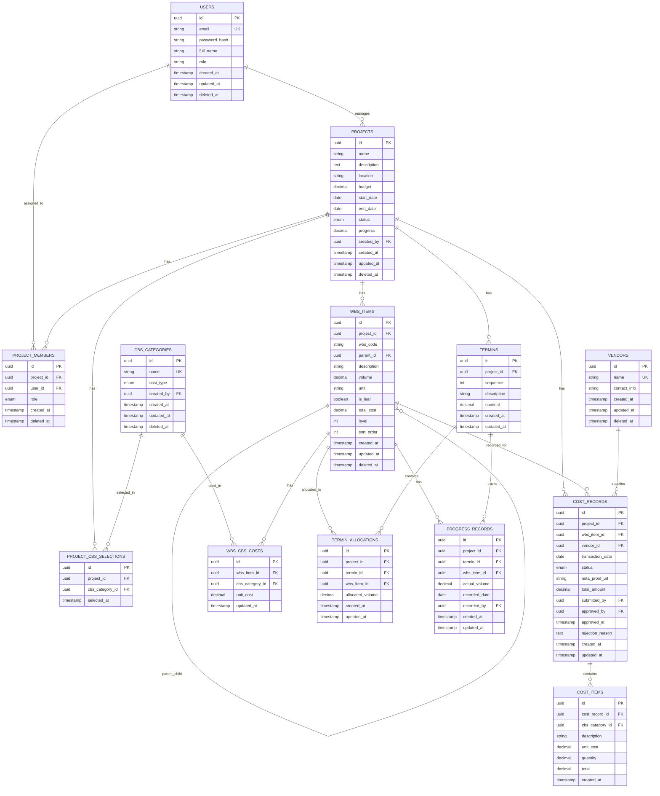

# Database Schema - Hexavara CBS System

> **Author**: Database Architect  
> **Version**: 1.0  
> **Last Updated**: 2026-02-05  
> **Database**: PostgreSQL (Recommended)

---

## Daftar Isi

1. [Overview](#1-overview)
2. [Entity Relationship Diagram](#2-entity-relationship-diagram)
3. [Table Definitions](#3-table-definitions)
4. [Relationships Summary](#4-relationships-summary)
5. [Indexes & Performance](#5-indexes--performance)
6. [Audit & Soft Delete Strategy](#6-audit--soft-delete-strategy)
7. [Business Rules & Constraints](#7-business-rules--constraints)
8. [Common Query Patterns](#8-common-query-patterns)
9. [Migration Strategy](#9-migration-strategy)

---

## 1. Overview

### 1.1 System Context

Hexavara CBS adalah sistem manajemen proyek konstruksi yang mencakup:

- **Project Management**: Pengelolaan proyek dengan status lifecycle
- **CBS (Cost Breakdown Structure)**: Kategori biaya global dan seleksi per proyek
- **WBS (Work Breakdown Structure)**: Struktur pekerjaan hierarkis dengan kalkulasi biaya
- **Cost Control**: Pencatatan pengeluaran dengan approval workflow
- **Termin Planning**: Alokasi volume pekerjaan ke termin pembayaran
- **Progress Monitoring**: Tracking progress aktual per termin
- **User & Role Management**: Multi-user dengan role Mandor di level proyek

### 1.2 Design Principles

| Principle             | Implementation                                                |
| --------------------- | ------------------------------------------------------------- |
| **Normalization**     | 3NF untuk integritas, denormalisasi selektif untuk performa   |
| **Audit Trail**       | Semua tabel memiliki `created_at`, `updated_at`, `created_by` |
| **Soft Delete**       | Field `deleted_at` untuk data recovery                        |
| **UUID Primary Keys** | Distributed-friendly, tidak sequential                        |
| **PostgreSQL**        | JSONB support, performance, reliability                       |

---

## 2. Entity Relationship Diagram



---

## 3. Table Definitions

### 3.1 Users

Tabel untuk menyimpan data pengguna sistem.

```sql
CREATE TABLE users (
    id UUID PRIMARY KEY DEFAULT gen_random_uuid(),
    email VARCHAR(255) NOT NULL UNIQUE,
    password_hash VARCHAR(255) NOT NULL,
    full_name VARCHAR(255) NOT NULL,
    phone VARCHAR(20),
    role VARCHAR(50) NOT NULL DEFAULT 'user' CHECK (role IN ('admin', 'project_manager', 'user')),
    avatar_url TEXT,
    is_active BOOLEAN DEFAULT TRUE,
    last_login_at TIMESTAMP WITH TIME ZONE,
    created_at TIMESTAMP WITH TIME ZONE DEFAULT CURRENT_TIMESTAMP,
    updated_at TIMESTAMP WITH TIME ZONE DEFAULT CURRENT_TIMESTAMP,
    deleted_at TIMESTAMP WITH TIME ZONE
);

CREATE INDEX idx_users_email ON users(email) WHERE deleted_at IS NULL;
CREATE INDEX idx_users_role ON users(role) WHERE deleted_at IS NULL;
```

| Column          | Type         | Constraints      | Description            |
| --------------- | ------------ | ---------------- | ---------------------- |
| `id`            | UUID         | PK               | Unique identifier      |
| `email`         | VARCHAR(255) | NOT NULL, UNIQUE | Email login            |
| `password_hash` | VARCHAR(255) | NOT NULL         | Bcrypt hashed password |
| `full_name`     | VARCHAR(255) | NOT NULL         | Display name           |
| `role`          | VARCHAR(50)  | NOT NULL         | System-level role      |

---

### 3.2 Projects

Tabel utama untuk menyimpan data proyek.

```sql
CREATE TYPE project_status AS ENUM (
    'ongoing', 'finish', 'closed', 'maintenance', 'canceled', 'hold'
);

CREATE TABLE projects (
    id UUID PRIMARY KEY DEFAULT gen_random_uuid(),
    name VARCHAR(255) NOT NULL,
    description TEXT,
    location VARCHAR(255),
    budget DECIMAL(18, 2) NOT NULL DEFAULT 0 CHECK (budget >= 0),
    start_date DATE NOT NULL,
    end_date DATE NOT NULL,
    status project_status NOT NULL DEFAULT 'ongoing',
    progress DECIMAL(5, 2) DEFAULT 0 CHECK (progress >= 0 AND progress <= 100),
    created_by UUID NOT NULL REFERENCES users(id),
    created_at TIMESTAMP WITH TIME ZONE DEFAULT CURRENT_TIMESTAMP,
    updated_at TIMESTAMP WITH TIME ZONE DEFAULT CURRENT_TIMESTAMP,
    deleted_at TIMESTAMP WITH TIME ZONE,

    CONSTRAINT chk_project_dates CHECK (end_date >= start_date)
);

CREATE INDEX idx_projects_status ON projects(status) WHERE deleted_at IS NULL;
CREATE INDEX idx_projects_created_by ON projects(created_by) WHERE deleted_at IS NULL;
CREATE INDEX idx_projects_dates ON projects(start_date, end_date) WHERE deleted_at IS NULL;
```

| Column     | Type          | Constraints | Description           |
| ---------- | ------------- | ----------- | --------------------- |
| `id`       | UUID          | PK          | Unique identifier     |
| `name`     | VARCHAR(255)  | NOT NULL    | Project name          |
| `budget`   | DECIMAL(18,2) | >= 0        | Total budget (RAB)    |
| `status`   | ENUM          | NOT NULL    | Lifecycle status      |
| `progress` | DECIMAL(5,2)  | 0-100       | Physical completion % |

---

### 3.3 Project Members (Mandor Management)

Tabel untuk mengelola anggota proyek termasuk Mandor.

```sql
CREATE TYPE project_member_role AS ENUM (
    'project_manager', 'mandor', 'site_admin', 'viewer'
);

CREATE TABLE project_members (
    id UUID PRIMARY KEY DEFAULT gen_random_uuid(),
    project_id UUID NOT NULL REFERENCES projects(id) ON DELETE CASCADE,
    user_id UUID NOT NULL REFERENCES users(id),
    role project_member_role NOT NULL,
    assigned_at TIMESTAMP WITH TIME ZONE DEFAULT CURRENT_TIMESTAMP,
    assigned_by UUID REFERENCES users(id),
    created_at TIMESTAMP WITH TIME ZONE DEFAULT CURRENT_TIMESTAMP,
    deleted_at TIMESTAMP WITH TIME ZONE,

    CONSTRAINT uq_project_member UNIQUE (project_id, user_id)
);

CREATE INDEX idx_project_members_project ON project_members(project_id) WHERE deleted_at IS NULL;
CREATE INDEX idx_project_members_user ON project_members(user_id) WHERE deleted_at IS NULL;
```

| Column       | Type | Constraints   | Description                         |
| ------------ | ---- | ------------- | ----------------------------------- |
| `project_id` | UUID | FK → projects | Associated project                  |
| `user_id`    | UUID | FK → users    | Assigned user                       |
| `role`       | ENUM | NOT NULL      | Role dalam proyek (mandor, pm, dll) |

> **Note**: User dengan role `project_manager` dapat CRUD akun `mandor` dalam proyek tersebut.

---

### 3.4 CBS Categories (Global Master)

Tabel master untuk kategori biaya.

```sql
CREATE TYPE cbs_cost_type AS ENUM ('Per Item', 'Borongan');

CREATE TABLE cbs_categories (
    id UUID PRIMARY KEY DEFAULT gen_random_uuid(),
    name VARCHAR(100) NOT NULL,
    cost_type cbs_cost_type NOT NULL,
    description TEXT,
    created_by UUID REFERENCES users(id),
    created_at TIMESTAMP WITH TIME ZONE DEFAULT CURRENT_TIMESTAMP,
    updated_at TIMESTAMP WITH TIME ZONE DEFAULT CURRENT_TIMESTAMP,
    deleted_at TIMESTAMP WITH TIME ZONE,

    CONSTRAINT uq_cbs_name_type UNIQUE (name, cost_type)
);

CREATE INDEX idx_cbs_categories_name ON cbs_categories(name) WHERE deleted_at IS NULL;
```

| Column      | Type         | Constraints | Description                                   |
| ----------- | ------------ | ----------- | --------------------------------------------- |
| `name`      | VARCHAR(100) | NOT NULL    | Nama kategori (Material, Sewa Alat, dll)      |
| `cost_type` | ENUM         | NOT NULL    | 'Per Item' (× volume) atau 'Borongan' (fixed) |

**Cost Type Rules:**

- **Per Item**: `total = unit_cost × volume`
- **Borongan**: `total = unit_cost` (tidak dikalikan volume)

---

### 3.5 Project CBS Selections

Junction table untuk CBS yang dipilih per proyek.

```sql
CREATE TABLE project_cbs_selections (
    id UUID PRIMARY KEY DEFAULT gen_random_uuid(),
    project_id UUID NOT NULL REFERENCES projects(id) ON DELETE CASCADE,
    cbs_category_id UUID NOT NULL REFERENCES cbs_categories(id),
    selected_at TIMESTAMP WITH TIME ZONE DEFAULT CURRENT_TIMESTAMP,
    selected_by UUID REFERENCES users(id),

    CONSTRAINT uq_project_cbs UNIQUE (project_id, cbs_category_id)
);

CREATE INDEX idx_project_cbs_project ON project_cbs_selections(project_id);
```

---

### 3.6 Termins

Tabel untuk jadwal termin pembayaran proyek.

```sql
CREATE TABLE termins (
    id UUID PRIMARY KEY DEFAULT gen_random_uuid(),
    project_id UUID NOT NULL REFERENCES projects(id) ON DELETE CASCADE,
    sequence INT NOT NULL CHECK (sequence > 0),
    description VARCHAR(255) NOT NULL,
    nominal DECIMAL(18, 2) NOT NULL CHECK (nominal >= 0),
    created_at TIMESTAMP WITH TIME ZONE DEFAULT CURRENT_TIMESTAMP,
    updated_at TIMESTAMP WITH TIME ZONE DEFAULT CURRENT_TIMESTAMP,

    CONSTRAINT uq_project_termin_sequence UNIQUE (project_id, sequence)
);

CREATE INDEX idx_termins_project ON termins(project_id);
```

| Column     | Type          | Constraints             | Description                |
| ---------- | ------------- | ----------------------- | -------------------------- |
| `sequence` | INT           | > 0, UNIQUE per project | Urutan termin (1, 2, 3...) |
| `nominal`  | DECIMAL(18,2) | >= 0                    | Target nilai termin        |

---

### 3.7 WBS Items

Tabel untuk struktur pekerjaan hierarkis.

```sql
CREATE TABLE wbs_items (
    id UUID PRIMARY KEY DEFAULT gen_random_uuid(),
    project_id UUID NOT NULL REFERENCES projects(id) ON DELETE CASCADE,
    wbs_code VARCHAR(50) NOT NULL,
    parent_id UUID REFERENCES wbs_items(id) ON DELETE CASCADE,
    description VARCHAR(500) NOT NULL,
    volume DECIMAL(12, 4) DEFAULT 0 CHECK (volume >= 0),
    unit VARCHAR(20),
    is_leaf BOOLEAN NOT NULL DEFAULT TRUE,
    total_cost DECIMAL(18, 2) DEFAULT 0,
    level INT NOT NULL DEFAULT 1 CHECK (level > 0),
    sort_order INT DEFAULT 0,
    created_at TIMESTAMP WITH TIME ZONE DEFAULT CURRENT_TIMESTAMP,
    updated_at TIMESTAMP WITH TIME ZONE DEFAULT CURRENT_TIMESTAMP,
    deleted_at TIMESTAMP WITH TIME ZONE,

    CONSTRAINT uq_project_wbs_code UNIQUE (project_id, wbs_code),
    CONSTRAINT chk_parent_not_self CHECK (parent_id != id)
);

CREATE INDEX idx_wbs_project ON wbs_items(project_id) WHERE deleted_at IS NULL;
CREATE INDEX idx_wbs_parent ON wbs_items(parent_id) WHERE deleted_at IS NULL;
CREATE INDEX idx_wbs_code ON wbs_items(wbs_code) WHERE deleted_at IS NULL;
CREATE INDEX idx_wbs_is_leaf ON wbs_items(is_leaf) WHERE deleted_at IS NULL;
```

| Column       | Type          | Constraints           | Description                           |
| ------------ | ------------- | --------------------- | ------------------------------------- |
| `wbs_code`   | VARCHAR(50)   | UNIQUE per project    | Hierarchical ID ("1", "1.1", "1.1.1") |
| `parent_id`  | UUID          | FK → wbs_items (self) | Nullable for root items               |
| `is_leaf`    | BOOLEAN       | NOT NULL              | Can input costs if TRUE               |
| `level`      | INT           | > 0                   | Hierarchy depth (1, 2, 3...)          |
| `total_cost` | DECIMAL(18,2) |                       | Calculated or summed from children    |

> **Hierarchy Rules:**
>
> - `is_leaf = true`: Dapat input biaya CBS, tidak punya children
> - `is_leaf = false`: `total_cost` = SUM of children's `total_cost`
> - Minimum 2 level, tapi fleksibel (leaf bisa di level 2)

---

### 3.8 WBS CBS Costs

Tabel untuk menyimpan biaya per kategori CBS di WBS item.

```sql
CREATE TABLE wbs_cbs_costs (
    id UUID PRIMARY KEY DEFAULT gen_random_uuid(),
    wbs_item_id UUID NOT NULL REFERENCES wbs_items(id) ON DELETE CASCADE,
    cbs_category_id UUID NOT NULL REFERENCES cbs_categories(id),
    unit_cost DECIMAL(18, 2) NOT NULL DEFAULT 0 CHECK (unit_cost >= 0),
    updated_at TIMESTAMP WITH TIME ZONE DEFAULT CURRENT_TIMESTAMP,

    CONSTRAINT uq_wbs_cbs UNIQUE (wbs_item_id, cbs_category_id)
);

CREATE INDEX idx_wbs_cbs_wbs ON wbs_cbs_costs(wbs_item_id);
CREATE INDEX idx_wbs_cbs_category ON wbs_cbs_costs(cbs_category_id);
```

| Column            | Type          | Description                                           |
| ----------------- | ------------- | ----------------------------------------------------- |
| `wbs_item_id`     | UUID          | FK to WBS leaf item                                   |
| `cbs_category_id` | UUID          | FK to CBS category                                    |
| `unit_cost`       | DECIMAL(18,2) | Cost per unit (for Per Item) or fixed cost (Borongan) |

---

### 3.9 Termin Allocations

Tabel untuk alokasi volume WBS ke termin.

```sql
CREATE TABLE termin_allocations (
    id UUID PRIMARY KEY DEFAULT gen_random_uuid(),
    project_id UUID NOT NULL REFERENCES projects(id) ON DELETE CASCADE,
    termin_id UUID NOT NULL REFERENCES termins(id) ON DELETE CASCADE,
    wbs_item_id UUID NOT NULL REFERENCES wbs_items(id) ON DELETE CASCADE,
    allocated_volume DECIMAL(12, 4) NOT NULL CHECK (allocated_volume >= 0),
    created_at TIMESTAMP WITH TIME ZONE DEFAULT CURRENT_TIMESTAMP,
    updated_at TIMESTAMP WITH TIME ZONE DEFAULT CURRENT_TIMESTAMP,

    CONSTRAINT uq_termin_wbs UNIQUE (termin_id, wbs_item_id)
);

CREATE INDEX idx_termin_alloc_project ON termin_allocations(project_id);
CREATE INDEX idx_termin_alloc_termin ON termin_allocations(termin_id);
CREATE INDEX idx_termin_alloc_wbs ON termin_allocations(wbs_item_id);
```

| Column             | Type          | Description                            |
| ------------------ | ------------- | -------------------------------------- |
| `termin_id`        | UUID          | Target termin                          |
| `wbs_item_id`      | UUID          | WBS item yang dialokasikan             |
| `allocated_volume` | DECIMAL(12,4) | Volume yang dialokasikan ke termin ini |

> **Important**: `remaining_volume` TIDAK disimpan di database.  
> Dihitung: `remaining = wbs.volume - SUM(termin_allocations.allocated_volume)`

---

### 3.10 Progress Records

Tabel untuk tracking progress aktual per termin.

```sql
CREATE TABLE progress_records (
    id UUID PRIMARY KEY DEFAULT gen_random_uuid(),
    project_id UUID NOT NULL REFERENCES projects(id) ON DELETE CASCADE,
    termin_id UUID NOT NULL REFERENCES termins(id) ON DELETE CASCADE,
    wbs_item_id UUID NOT NULL REFERENCES wbs_items(id) ON DELETE CASCADE,
    actual_volume DECIMAL(12, 4) NOT NULL CHECK (actual_volume >= 0),
    recorded_date DATE NOT NULL DEFAULT CURRENT_DATE,
    notes TEXT,
    recorded_by UUID REFERENCES users(id),
    created_at TIMESTAMP WITH TIME ZONE DEFAULT CURRENT_TIMESTAMP,
    updated_at TIMESTAMP WITH TIME ZONE DEFAULT CURRENT_TIMESTAMP,

    CONSTRAINT uq_progress_termin_wbs UNIQUE (termin_id, wbs_item_id)
);

CREATE INDEX idx_progress_project ON progress_records(project_id);
CREATE INDEX idx_progress_termin ON progress_records(termin_id);
CREATE INDEX idx_progress_wbs ON progress_records(wbs_item_id);
```

---

### 3.11 Vendors

Tabel master untuk vendor/supplier.

```sql
CREATE TABLE vendors (
    id UUID PRIMARY KEY DEFAULT gen_random_uuid(),
    name VARCHAR(255) NOT NULL,
    contact_person VARCHAR(255),
    phone VARCHAR(50),
    email VARCHAR(255),
    address TEXT,
    created_at TIMESTAMP WITH TIME ZONE DEFAULT CURRENT_TIMESTAMP,
    updated_at TIMESTAMP WITH TIME ZONE DEFAULT CURRENT_TIMESTAMP,
    deleted_at TIMESTAMP WITH TIME ZONE,

    CONSTRAINT uq_vendor_name UNIQUE (name)
);

CREATE INDEX idx_vendors_name ON vendors(name) WHERE deleted_at IS NULL;
```

> **Auto-Create Logic**: Backend harus handle jika vendor name belum ada, otomatis insert ke master.

---

### 3.12 Cost Records

Tabel untuk pencatatan biaya dengan approval workflow.

```sql
CREATE TYPE cost_record_status AS ENUM ('pending', 'approved', 'rejected');

CREATE TABLE cost_records (
    id UUID PRIMARY KEY DEFAULT gen_random_uuid(),
    project_id UUID NOT NULL REFERENCES projects(id) ON DELETE CASCADE,
    wbs_item_id UUID NOT NULL REFERENCES wbs_items(id),
    vendor_id UUID REFERENCES vendors(id),
    transaction_date DATE NOT NULL,
    status cost_record_status NOT NULL DEFAULT 'pending',
    nota_proof_url TEXT,
    total_amount DECIMAL(18, 2) NOT NULL DEFAULT 0,
    submitted_by UUID NOT NULL REFERENCES users(id),
    approved_by UUID REFERENCES users(id),
    approved_at TIMESTAMP WITH TIME ZONE,
    rejection_reason TEXT,
    notes TEXT,
    created_at TIMESTAMP WITH TIME ZONE DEFAULT CURRENT_TIMESTAMP,
    updated_at TIMESTAMP WITH TIME ZONE DEFAULT CURRENT_TIMESTAMP,

    CONSTRAINT chk_approval_consistency CHECK (
        (status = 'approved' AND nota_proof_url IS NOT NULL) OR
        (status != 'approved')
    )
);

CREATE INDEX idx_cost_records_project ON cost_records(project_id);
CREATE INDEX idx_cost_records_wbs ON cost_records(wbs_item_id);
CREATE INDEX idx_cost_records_status ON cost_records(status);
CREATE INDEX idx_cost_records_date ON cost_records(transaction_date);
CREATE INDEX idx_cost_records_vendor ON cost_records(vendor_id);
```

| Column           | Type          | Constraints          | Description                         |
| ---------------- | ------------- | -------------------- | ----------------------------------- |
| `status`         | ENUM          | NOT NULL             | 'pending' → 'approved' / 'rejected' |
| `nota_proof_url` | TEXT          | Required if approved | URL bukti nota                      |
| `total_amount`   | DECIMAL(18,2) | Calculated           | SUM of cost_items.total             |

**Approval Workflow:**

1. `pending` → User submit request
2. `approved` → PM approve (WAJIB upload nota)
3. `rejected` → PM reject (optional reason)

---

### 3.13 Cost Items

Tabel detail item dalam cost record.

```sql
CREATE TABLE cost_items (
    id UUID PRIMARY KEY DEFAULT gen_random_uuid(),
    cost_record_id UUID NOT NULL REFERENCES cost_records(id) ON DELETE CASCADE,
    cbs_category_id UUID REFERENCES cbs_categories(id),
    description VARCHAR(500) NOT NULL,
    unit_cost DECIMAL(18, 2) NOT NULL CHECK (unit_cost >= 0),
    quantity DECIMAL(12, 4) NOT NULL CHECK (quantity > 0),
    total DECIMAL(18, 2) GENERATED ALWAYS AS (unit_cost * quantity) STORED,
    created_at TIMESTAMP WITH TIME ZONE DEFAULT CURRENT_TIMESTAMP
);

CREATE INDEX idx_cost_items_record ON cost_items(cost_record_id);
CREATE INDEX idx_cost_items_cbs ON cost_items(cbs_category_id);
```

| Column            | Type    | Description                             |
| ----------------- | ------- | --------------------------------------- |
| `cbs_category_id` | UUID    | Optional CBS category per item          |
| `total`           | DECIMAL | Auto-calculated: `unit_cost × quantity` |

---

## 4. Relationships Summary

### 4.1 One-to-Many (1:N)

| Parent         | Child                | Relationship                  |
| -------------- | -------------------- | ----------------------------- |
| `users`        | `projects`           | User creates many projects    |
| `projects`     | `termins`            | Project has many termins      |
| `projects`     | `wbs_items`          | Project has many WBS items    |
| `projects`     | `cost_records`       | Project has many cost records |
| `wbs_items`    | `wbs_items`          | Self-referential hierarchy    |
| `wbs_items`    | `wbs_cbs_costs`      | WBS item has costs per CBS    |
| `cost_records` | `cost_items`         | Record has many line items    |
| `termins`      | `termin_allocations` | Termin has many allocations   |
| `vendors`      | `cost_records`       | Vendor supplies many records  |

### 4.2 Many-to-Many (N:N)

| Entity A    | Entity B         | Junction Table           |
| ----------- | ---------------- | ------------------------ |
| `projects`  | `users`          | `project_members`        |
| `projects`  | `cbs_categories` | `project_cbs_selections` |
| `wbs_items` | `cbs_categories` | `wbs_cbs_costs`          |
| `termins`   | `wbs_items`      | `termin_allocations`     |

---

## 5. Indexes & Performance

### 5.1 Primary Indexes (Auto-created)

Semua Primary Key (`id`) otomatis diindex oleh PostgreSQL.

### 5.2 Query-Optimized Indexes

```sql
-- High-frequency lookups
CREATE INDEX idx_projects_status ON projects(status) WHERE deleted_at IS NULL;
CREATE INDEX idx_wbs_project_leaf ON wbs_items(project_id, is_leaf) WHERE deleted_at IS NULL;
CREATE INDEX idx_cost_records_project_status ON cost_records(project_id, status);

-- Date range queries
CREATE INDEX idx_projects_dates ON projects(start_date, end_date) WHERE deleted_at IS NULL;
CREATE INDEX idx_cost_records_date_range ON cost_records(transaction_date, project_id);

-- Hierarchical queries
CREATE INDEX idx_wbs_parent ON wbs_items(parent_id) WHERE deleted_at IS NULL;

-- Text search (if needed)
CREATE INDEX idx_vendors_name_search ON vendors USING gin(to_tsvector('indonesian', name));
```

### 5.3 Performance Considerations

| Query Pattern      | Optimization                             |
| ------------------ | ---------------------------------------- |
| WBS tree traversal | Recursive CTE + materialized path        |
| Cost aggregation   | Pre-calculated `total_cost` on WBS items |
| Dashboard stats    | Consider materialized views or cache     |
| Report generation  | Partitioning by date if data grows       |

---

## 6. Audit & Soft Delete Strategy

### 6.1 Audit Columns

Semua tabel include:

```sql
created_at TIMESTAMP WITH TIME ZONE DEFAULT CURRENT_TIMESTAMP,
updated_at TIMESTAMP WITH TIME ZONE DEFAULT CURRENT_TIMESTAMP
```

Tabel dengan user tracking juga include:

```sql
created_by UUID REFERENCES users(id)
```

### 6.2 Soft Delete

Tabel yang support soft delete:

| Table             | Reason                    |
| ----------------- | ------------------------- |
| `users`           | Account recovery          |
| `projects`        | Project history           |
| `cbs_categories`  | Prevent orphan references |
| `wbs_items`       | WBS history               |
| `vendors`         | Vendor history            |
| `project_members` | Membership history        |

```sql
-- All queries should filter:
WHERE deleted_at IS NULL
```

### 6.3 Auto-Update Trigger

```sql
CREATE OR REPLACE FUNCTION update_updated_at_column()
RETURNS TRIGGER AS $$
BEGIN
    NEW.updated_at = CURRENT_TIMESTAMP;
    RETURN NEW;
END;
$$ language 'plpgsql';

-- Apply to all tables
CREATE TRIGGER update_projects_updated_at
    BEFORE UPDATE ON projects
    FOR EACH ROW EXECUTE FUNCTION update_updated_at_column();
```

---

## 7. Business Rules & Constraints

### 7.1 Project Constraints

```sql
-- Project dates validation
CONSTRAINT chk_project_dates CHECK (end_date >= start_date)

-- Budget must be positive
CONSTRAINT chk_project_budget CHECK (budget >= 0)

-- Progress percentage
CONSTRAINT chk_progress_range CHECK (progress >= 0 AND progress <= 100)
```

### 7.2 WBS Rules

```sql
-- Self-reference check
CONSTRAINT chk_parent_not_self CHECK (parent_id != id)

-- Leaf node validation (enforced in application)
-- If is_leaf = false, should have children
-- If is_leaf = true, can have wbs_cbs_costs
```

### 7.3 Cost Record Rules

```sql
-- Approval requires nota
CONSTRAINT chk_approval_consistency CHECK (
    (status = 'approved' AND nota_proof_url IS NOT NULL) OR
    (status != 'approved')
)
```

### 7.4 Termin Rules

```sql
-- Sequence must be positive and unique per project
CONSTRAINT uq_project_termin_sequence UNIQUE (project_id, sequence)
CHECK (sequence > 0)

-- Sum of termin nominals should not exceed project budget (application-level)
```

### 7.5 Application-Level Rules

| Rule                          | Enforcement                   |
| ----------------------------- | ----------------------------- |
| Total termin ≤ project budget | Application validation        |
| Allocated volume ≤ WBS volume | Application validation        |
| WBS total_cost recalculation  | Trigger or application        |
| Project progress calculation  | Derived from progress_records |

---

## 8. Common Query Patterns

### 8.1 Get Project with All Relations

```sql
SELECT
    p.*,
    json_agg(DISTINCT t.*) AS termins,
    json_agg(DISTINCT cs.*) AS cbs_selections
FROM projects p
LEFT JOIN termins t ON t.project_id = p.id
LEFT JOIN project_cbs_selections pcs ON pcs.project_id = p.id
LEFT JOIN cbs_categories cs ON cs.id = pcs.cbs_category_id
WHERE p.id = :project_id AND p.deleted_at IS NULL
GROUP BY p.id;
```

### 8.2 Get WBS Tree (Recursive)

```sql
WITH RECURSIVE wbs_tree AS (
    -- Base case: root items
    SELECT *, 0 as depth
    FROM wbs_items
    WHERE project_id = :project_id
      AND parent_id IS NULL
      AND deleted_at IS NULL

    UNION ALL

    -- Recursive case: children
    SELECT w.*, wt.depth + 1
    FROM wbs_items w
    JOIN wbs_tree wt ON w.parent_id = wt.id
    WHERE w.deleted_at IS NULL
)
SELECT * FROM wbs_tree ORDER BY wbs_code;
```

### 8.3 Calculate Actual Cost per WBS

```sql
SELECT
    w.id,
    w.wbs_code,
    w.description,
    w.total_cost AS planned_cost,
    COALESCE(SUM(cr.total_amount), 0) AS actual_cost,
    w.total_cost - COALESCE(SUM(cr.total_amount), 0) AS variance
FROM wbs_items w
LEFT JOIN cost_records cr ON cr.wbs_item_id = w.id AND cr.status = 'approved'
WHERE w.project_id = :project_id AND w.deleted_at IS NULL
GROUP BY w.id
ORDER BY w.wbs_code;
```

### 8.4 Get Termin Allocation with Remaining

```sql
SELECT
    w.id,
    w.wbs_code,
    w.description,
    w.volume AS total_volume,
    COALESCE(ta.allocated_volume, 0) AS allocated_volume,
    w.volume - COALESCE(SUM(all_ta.allocated_volume), 0) AS remaining_volume
FROM wbs_items w
LEFT JOIN termin_allocations ta ON ta.wbs_item_id = w.id AND ta.termin_id = :termin_id
LEFT JOIN termin_allocations all_ta ON all_ta.wbs_item_id = w.id
WHERE w.project_id = :project_id
  AND w.is_leaf = true
  AND w.deleted_at IS NULL
GROUP BY w.id, ta.allocated_volume;
```

### 8.5 Dashboard Statistics

```sql
SELECT
    COUNT(*) FILTER (WHERE status = 'ongoing') AS ongoing_count,
    COUNT(*) FILTER (WHERE status = 'finish') AS completed_count,
    COUNT(*) AS total_projects,
    SUM(budget) AS total_budget
FROM projects
WHERE deleted_at IS NULL;
```

---

## 9. Migration Strategy

### 9.1 Initial Migration Order

Execute migrations in this order to respect foreign key dependencies:

1. `users`
2. `vendors`
3. `cbs_categories`
4. `projects`
5. `project_members`
6. `project_cbs_selections`
7. `termins`
8. `wbs_items`
9. `wbs_cbs_costs`
10. `termin_allocations`
11. `progress_records`
12. `cost_records`
13. `cost_items`

### 9.2 Seed Data

```sql
-- Default CBS Categories
INSERT INTO cbs_categories (name, cost_type) VALUES
    ('Material', 'Per Item'),
    ('Sewa Alat', 'Per Item'),
    ('Sewa Tenaga Kerja', 'Borongan'),
    ('Overhead', 'Borongan');

-- Default Admin User
INSERT INTO users (email, password_hash, full_name, role) VALUES
    ('admin@hexavara.com', '<bcrypt_hash>', 'System Admin', 'admin');
```

### 9.3 Rollback Strategy

Setiap migration harus memiliki `down` method yang aman:

```sql
-- Example rollback
DROP TABLE IF EXISTS cost_items CASCADE;
DROP TABLE IF EXISTS cost_records CASCADE;
-- ... (reverse order)
```

---

## Appendix A: Data Type Reference

| Frontend Type         | Database Type              | Notes                   |
| --------------------- | -------------------------- | ----------------------- |
| `string` (ID)         | `UUID`                     | Use `gen_random_uuid()` |
| `string`              | `VARCHAR(n)` or `TEXT`     | Limit where appropriate |
| `number` (currency)   | `DECIMAL(18,2)`            | 18 digits, 2 decimal    |
| `number` (volume)     | `DECIMAL(12,4)`            | 12 digits, 4 decimal    |
| `number` (percentage) | `DECIMAL(5,2)`             | 0.00 - 100.00           |
| `boolean`             | `BOOLEAN`                  |                         |
| `Date` string         | `DATE`                     | YYYY-MM-DD              |
| `DateTime` string     | `TIMESTAMP WITH TIME ZONE` | ISO 8601                |
| `enum`                | PostgreSQL `ENUM` type     | Type-safe               |

---

## Appendix B: API Contract Mapping

| Frontend Type   | API Endpoint                                                 | Database Operation            |
| --------------- | ------------------------------------------------------------ | ----------------------------- |
| `Project`       | `GET/POST/PATCH/DELETE /api/projects`                        | `projects` table              |
| `CBSData`       | `GET/POST/PUT/DELETE /api/cbs`                               | `cbs_categories` table        |
| `WBSData`       | `GET/POST/PATCH/DELETE /api/projects/:id/wbs`                | `wbs_items` + `wbs_cbs_costs` |
| `CostOutRecord` | `GET/POST /api/projects/:id/costs`                           | `cost_records` + `cost_items` |
| `TerminData`    | `GET/POST/PATCH/DELETE /api/projects/:id/termin-allocations` | `termin_allocations`          |
| `ProgressTask`  | `GET/POST/PATCH /api/projects/:id/progress`                  | `progress_records`            |

---

## Appendix C: Security Considerations

### Row-Level Security (RLS)

```sql
-- Enable RLS on projects
ALTER TABLE projects ENABLE ROW LEVEL SECURITY;

-- Policy: Users can only see their own projects or projects they're members of
CREATE POLICY project_access ON projects
    FOR ALL
    USING (
        created_by = current_user_id() OR
        EXISTS (
            SELECT 1 FROM project_members pm
            WHERE pm.project_id = projects.id
              AND pm.user_id = current_user_id()
              AND pm.deleted_at IS NULL
        )
    );
```

### Sensitive Data

| Column                        | Protection              |
| ----------------------------- | ----------------------- |
| `users.password_hash`         | Never return in API     |
| `users.email`                 | Sanitize in logs        |
| `cost_records.nota_proof_url` | Signed URLs with expiry |

---

> **Document Version History**
>
> - v1.0 (2026-02-05): Initial schema design based on frontend analysis
