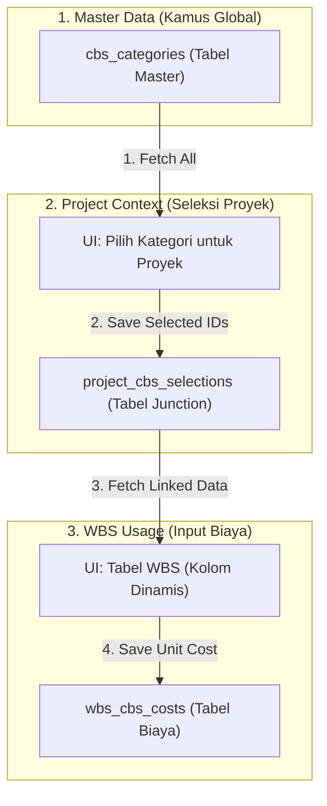

# CBS (Cost Breakdown Structure) - Complete Documentation

## Daftar Isi

1.  [Overview](#overview)
2.  [1. Data Types](#1-data-types)
3.  [2. File Structure](#2-file-structure)
4.  [3. Store Functions (useCBSStore)](#3-store-functions-usecbsstore)
5.  [4. Table Component (CBS-Table.tsx)](#4-table-component-cbs-tabletsx)
6.  [5. Application Flow](#5-application-flow)
7.  [6. Backend Integration](#6-backend-integration)
8.  [7. Selected CBS Flow to WBS](#7-selected-cbs-flow-to-wbs)
9.  [8. Integration Checklist](#8-integration-checklist)
10. [9. TanStack Query (React Query) Integration Guide](#9-tanstack-query-react-query-integration-guide)
11. [10. CBS Architecture & Data Flow](#10-cbs-architecture--data-flow)
12. [11. Detailed Selection Logic (Frontend Comparison)](#11-detailed-selection-logic-frontend-comparison)

## Overview

CBS adalah sistem untuk mengelola kategori biaya yang tersedia secara global. Kategori yang dibuat di sini akan tersedia untuk dipilih di setiap proyek melalui halaman Project Overview. Setelah dipilih di tingkat proyek, kategori tersebut menjadi kolom biaya di tabel WBS proyek tersebut.

---

## 1. Data Types

```typescript
// src/types/cbs-wbs.ts
export type CBSData = {
  name: string; // Nama kategori (ex: "Material", "Sewa Alat")
  type: string; // Tipe biaya: "Per Item" | "Borongan"
  selected: boolean; // Status seleksi untuk WBS (confirmed state)
};
```

**Cost Types:**
| Type | Formula | Contoh |
|------|---------|--------|
| Per Item | `cost × volume` | Material: Rp 50.000 × 100 = Rp 5.000.000 |
| Borongan | `cost` (fixed) | Jasa: Rp 1.000.000 (tidak dikalikan volume) |

---

## 2. File Structure

```
src/
├── app/cbs/
│   ├── page.tsx              # Halaman CBS utama
│   └── type.ts               # Form types
├── components/cbs/
│   ├── CBS-Table.tsx         # Table component (dengan Edit & Delete)
│   └── CBSFormDialog.tsx     # Reusable Dialog Form (Add & Edit)
├── store/
├── store/
│   └── useCBSStore.ts        # Zustand store
└── types/
    └── cbs-wbs.ts            # Type definitions
```

---

## 3. Store Functions (useCBSStore)

```typescript
// src/store/useCBSStore.ts
type CBSStore = {
  cbsData: CBSData[];
  pendingSelection: Set<number>; // Digunakan saat seleksi (perlu dikonsumsi oleh store proyek jika diperlukan)
  setCBSData: (data: CBSData[]) => void;
  addCategory: (category: CBSData) => void;
  updateCategory: (index: number, data: CBSData) => void;
  deleteCategory: (index: number) => void;
  toggleSelect: (index: number) => void;
  confirmSelection: () => void;
  cancelSelection: () => void;
  getPendingState: (index: number) => boolean;
  hasPendingChanges: () => boolean;
  getSelectedCBS: () => CBSData[];
};
```

### Store Functions Reference

| Function                   | Description                                           | Return      |
| -------------------------- | ----------------------------------------------------- | ----------- |
| `setCBSData(data)`         | Set CBS data dari backend, reset pending selection    | `void`      |
| `addCategory(category)`    | Tambah kategori baru ke list                          | `void`      |
| `updateCategory(idx, val)` | Update kategori (edit name/type)                      | `void`      |
| `toggleSelect(index)`      | Toggle pending selection (belum apply ke `selected`)  | `void`      |
| `confirmSelection()`       | Apply semua pending selection ke `selected` state     | `void`      |
| `cancelSelection()`        | Reset/buang semua pending selection                   | `void`      |
| `deleteCategory(index)`    | Menghapus kategori secara permanen dari daftar global | `void`      |
| `getPendingState(index)`   | Get effective state untuk UI (selected XOR pending)   | `boolean`   |
| `hasPendingChanges()`      | Check apakah ada pending changes                      | `boolean`   |
| `getSelectedCBS()`         | Get CBS yang sudah confirmed selected                 | `CBSData[]` |

```
┌─────────────────────────────────────────────────────────────────┐
│ CBS MANAGEMENT FLOW (/cbs)                                       │
├─────────────────────────────────────────────────────────────────┤
│                                                                  │
│   Halaman ini digunakan untuk mengelola daftar MASTER kategori.  │
│                                                                  │
│   1. ADD: Klik "+ Add New Category" → Modal → Simpan.            │
│   2. EDIT: Klik ikon pensil (Edit) di baris kategori.            │
│   3. DELETE: Klik ikon sampah (Trash2) di baris kategori.        │
│                                                                  │
├─────────────────────────────────────────────────────────────────┤
│                                                                  │
│ CBS SELECTION FLOW (Halaman Detail Proyek)                       │
├─────────────────────────────────────────────────────────────────┤
│                                                                  │
│   Seleksi kategori untuk digunakan di proyek (WBS) dilakukan di  │
│   halaman Detail Proyek.                                         │
│                                                                  │
│   1. Klik "Edit Selection"                                       │
│   1a. (Optional) Klik "+ Tambah CBS Baru" untuk buat kategori    │
│       baru via Dialog (otomatis terpilih untuk proyek ini).      │
│   2. Centang kategori yang diinginkan                            │
│   3. Klik "Save Changes"                                         │
│                                                                  │
└─────────────────────────────────────────────────────────────────┘
```

### Handling Toggle & Selection Logic (Detail)

Untuk menangani seleksi kategori tanpa merusak data asli sebelum disimpan, gunakan pola **Pending State** yang sudah ada di `useCBSStore.ts`:

1.  **Akses State**: Gunakan `getPendingState(index)` untuk menentukan nilai `checked` pada checkbox. Fungsi ini menggabungkan status `selected` asli dengan perubahan sementara (`pendingSelection`).
2.  **Toggle Action**: Panggil `toggleSelect(index)` saat checkbox diklik. Ini **TIDAK** mengubah data `selected` di database/store utama, melainkan hanya mencatat "rencana perubahan".
3.  **Confirm (Save)**: Saat user klik "Save Changes", panggil `confirmSelection()` diikuti `getSelectedCBS()`. Hasil dari `getSelectedCBS()` inilah yang dikirim ke API `PATCH /api/projects/:id`.
4.  **Cancel**: Jika user menutup modal atau klik "Cancel", panggil `cancelSelection()` untuk menghapus semua rencana perubahan.

````

---

## 4. Table Component (CBS-Table.tsx)

### Props

```typescript
type CBSTableProps = {
  data: CBSData[]; // Array of CBS items
};
````

### Headers

```typescript
const headers = ["No", "Name", "Cost Type", "Action"];
```

### Rendering

```tsx
// Each row contains:
<tr>
  <td>{index + 1}</td> {/* No */}
  <td>{item.name}</td> {/* Name */}
  <td>
    <Badge>{item.type}</Badge>
  </td>{" "}
  {/* Cost Type with badge */}
  <td>
    <Button onClick={() => deleteCategory(index)}>
      <Trash2 />
    </Button>
  </td>{" "}
  {/* Action - Delete function */}
</tr>
```

### Styling

- **Header**: Dark gray (`bg-gray-700 text-white`)
- **Rows**: White with hover (`hover:bg-gray-50`)
- **Cost Type Badge**:
  - Per Item: Blue (`bg-blue-100 text-blue-800`)
  - Borongan: Green (`bg-green-100 text-green-800`)

---

## 5. Application Flow

### A. Render Data (GET)

```typescript
// Di page.tsx
const { cbsData, setCBSData } = useCBSStore();

useEffect(() => {
  async function fetchCBS() {
    const response = await fetch("/api/cbs");
    const data = await response.json();
    setCBSData(data);
  }
  fetchCBS();
}, []);

// Render
<CBSTable data={cbsData} />
```

### B. Create New Category (POST)

```typescript
const { addCategory } = useCBSStore();

async function handleSubmitNewCategory(formData) {
  // 1. POST ke backend
  const response = await fetch("/api/cbs", {
    method: "POST",
    headers: { "Content-Type": "application/json" },
    body: JSON.stringify({
      name: formData.category_name,
      type: formData.category_type,
    }),
  });

  // 2. Update store
  if (response.ok) {
    addCategory({
      name: formData.category_name,
      type: formData.category_type,
      selected: false,
    });
  }
}
```

### C. Select Categories (dengan Pending Flow)

```typescript
const { toggleSelect, getPendingState, confirmSelection, getSelectedCBS } = useCBSStore();

// Toggle saat checkbox diklik (marks as pending, not confirmed)
<Checkbox
  checked={getPendingState(index)}
  onCheckedChange={() => toggleSelect(index)}
/>

// Confirm selections when user clicks Save and confirms dialog
function handleConfirmCBS() {
  // Apply pending selections to actual selected state
  confirmSelection();

  // Get confirmed selected CBS
  const selectedCBS = getSelectedCBS();

  // Navigate to WBS
  router.push("/wbs");
}
```

---

## 6. Backend Integration

### GET: Fetch CBS Data

**Endpoint:** `GET /api/cbs`

**Response:**

```json
[
  { "name": "Material", "type": "Per Item", "selected": false },
  { "name": "Sewa Alat", "type": "Per Item", "selected": false },
  { "name": "Sewa Tenaga Kerja", "type": "Borongan", "selected": false }
]
```

**Frontend Integration:**

```typescript
useEffect(() => {
  async function fetchCBS() {
    try {
      const response = await fetch("/api/cbs");
      if (!response.ok) throw new Error("Failed to fetch");

      const data: CBSData[] = await response.json();
      setCBSData(data);
    } catch (error) {
      toast.error("Gagal memuat data CBS");
    }
  }
  fetchCBS();
}, []);
```

### POST: Create New Category

**Endpoint:** `POST /api/cbs`

**Request:**

```json
{
  "name": "Overhead",
  "type": "Borongan"
}
```

**Response:**

```json
{
  "id": 4,
  "name": "Overhead",
  "type": "Borongan",
  "selected": false
}
```

**Frontend Integration:**

```typescript
async function handleSubmitNewCategory(formData: CreateNewCBSFormValues) {
  try {
    const response = await fetch("/api/cbs", {
      method: "POST",
      headers: { "Content-Type": "application/json" },
      body: JSON.stringify({
        name: formData.category_name,
        type: formData.category_type,
      }),
    });

    if (!response.ok) throw new Error("Failed to create");

    const newCategory = await response.json();
    addCategory({
      name: newCategory.name,
      type: newCategory.type,
      selected: false,
    });

    toast.success("Kategori berhasil ditambahkan!");
  } catch (error) {
    toast.error("Gagal menambahkan kategori");
  }
}
```

### PUT: Update Category (if needed)

**Endpoint:** `PUT /api/cbs/:id`

**Request:**

```json
{
  "name": "Updated Name",
  "type": "Per Item"
}
```

**Frontend Integration:**

```typescript
async function handleUpdateCategory(id: string, updates: Partial<CBSData>) {
  try {
    const response = await fetch(`/api/cbs/${id}`, {
      method: "PUT",
      headers: { "Content-Type": "application/json" },
      body: JSON.stringify(updates),
    });

    if (!response.ok) throw new Error("Failed to update");

    // Refetch or update local state
    toast.success("Kategori berhasil diupdate!");
  } catch (error) {
    toast.error("Gagal mengupdate kategori");
  }
}
```

### PUT: Update Category

**Endpoint:** `PUT /api/cbs/:id`
// ... (sama seperti di atas)

**Frontend Integration:**

```typescript
async function handleEditCategory(index: number, formData: CBSFormValues) {
  // Logic serupa dengan Add, tapi panggil updateCategory di store
  updateCategory(index, {
    name: formData.category_name,
    type: formData.category_type,
    selected: cbsData[index].selected, // Preserve selection status
  });
}
```

### DELETE: Delete Category (if needed)

**Endpoint:** `DELETE /api/cbs/:id`

**Frontend Integration:**

```typescript
async function handleDeleteCategory(id: string) {
  try {
    const response = await fetch(`/api/cbs/${id}`, {
      method: "DELETE",
    });

    if (!response.ok) throw new Error("Failed to delete");

    // Refetch or update local state
    toast.success("Kategori berhasil dihapus!");
  } catch (error) {
    toast.error("Gagal menghapus kategori");
  }
}
```

---

## 7. Selected CBS Flow to WBS

Setelah user memilih CBS dan klik "Save" → Confirm Dialog → Continue:

```typescript
function handleConfirmCBS() {
  // 1. Apply pending selections to selected state
  confirmSelection();

  // 2. Get confirmed selections
  const selectedCBS = getSelectedCBS();

  // selectedCBS akan digunakan sebagai:
  // - Column headers di WBS table
  // - Keys di cbs_category map untuk setiap WBS item

  // 3. Navigate to WBS page
  router.push("/wbs");
}
```

**Contoh selectedCBS:**

```json
[
  { "name": "Material", "type": "Per Item" },
  { "name": "Sewa Tenaga Kerja", "type": "Borongan" }
]
```

Ini akan menjadi kolom di WBS table: `Material (Per Item)`, `Sewa Tenaga Kerja (Borongan)`

> [!IMPORTANT]
> **API Flow Note:**  
> Pembaruan seleksi CBS per proyek **TIDAK** menggunakan API CBS, melainkan menggunakan API Project:  
> **Endpoint:** `PATCH /api/projects/:id`  
> **Payload:** `{ "cbs_categories": CBSData[] }`  
> Hal ini dilakukan agar data seleksi tersimpan sebagai atribut dari proyek tersebut (Atomicity).

---

## 8. Integration Checklist

Ketika mengintegrasikan dengan backend, pastikan:

### GET /api/cbs

- [ ] Endpoint mengembalikan array `CBSData[]`
- [ ] Setiap item memiliki `name`, `type`, dan `selected`
- [ ] Handle loading state saat fetch
- [ ] Handle error jika fetch gagal

### POST /api/cbs

- [ ] Endpoint menerima `{ name, type }` dalam body
- [ ] Endpoint mengembalikan data kategori yang baru dibuat
- [ ] Update store setelah POST berhasil
- [ ] Show success/error toast

### PUT /api/cbs/:id (opsional)

- [ ] Endpoint menerima partial update `{ name?, type? }`
- [ ] Update store setelah PUT berhasil

### DELETE /api/cbs/:id (opsional)

- [ ] Endpoint menghapus kategori berdasarkan ID
- [ ] Update store setelah DELETE berhasil
- [ ] Pertimbangkan impact pada WBS yang sudah menggunakan kategori ini

### Selection Flow

- [ ] Checkbox toggle hanya mengubah pending state
- [ ] Confirm dialog muncul saat klik Save
- [ ] `confirmSelection()` dipanggil setelah user confirm
- [ ] `getSelectedCBS()` mengambil data yang sudah confirmed

---

## 9. TanStack Query (React Query) Integration Guide

### Step 1: Query untuk Master CBS List

Gunakan `useQuery` untuk mengambil daftar kategori CBS dari database.

```typescript
// src/hooks/useCBS.ts
import { useQuery } from "@tanstack/react-query";

export const useCBSQuery = () => {
  return useQuery({
    queryKey: ["cbs"],
    queryFn: async () => {
      const response = await fetch("/api/cbs");
      return response.json();
    },
  });
};
```

### Step 2: Mutation untuk Master CBS CRUD

```typescript
// src/hooks/useCBSMutations.ts
import { useMutation, useQueryClient } from "@tanstack/react-query";

export const useCBSMutations = () => {
  const queryClient = useQueryClient();

  // Tambah kategori baru
  const addCBSMutation = useMutation({
    mutationFn: async (newCategory: Partial<CBSData>) => {
      return fetch("/api/cbs", {
        method: "POST",
        body: JSON.stringify(newCategory),
      });
    },
    onSuccess: () => {
      queryClient.invalidateQueries({ queryKey: ["cbs"] });
    },
  });

  // Hapus kategori
  const deleteCBSMutation = useMutation({
    mutationFn: async (id: string) => {
      return fetch(`/api/cbs/${id}`, { method: "DELETE" });
    },
    onSuccess: () => {
      queryClient.invalidateQueries({ queryKey: ["cbs"] });
    },
  });

  return { addCBSMutation, deleteCBSMutation };
};
```

### Step 3: Integrasi dengan Project Selection

Meskipun CBS master menggunakan TanStack Query, proses **Seleksi CBS** per proyek tetap direkomendasikan menggunakan perpaduan `Zustand` (untuk _pending state_ / checkout flow) dan `useMutation` TanStack Query untuk tahap final save ke project backend.

```tsx
// Di Halaman Detail Proyek (Section CBS)
const { data: cbsMaster } = useCBSQuery();
const { updateProjectMutation } = useProjectMutations(projectId); // Dari Project Documentation

const handleSaveSelection = () => {
  const selectedItems = getSelectedCBS(); // Dari Zustand store
  updateProjectMutation.mutate({ cbs_categories: selectedItems });
};
```

### Keuntungan TanStack Query di CBS:

1. **Global Cache**: Jika user bolak-balik antara halaman Master CBS dan Detail Proyek, data tidak perlu di-fetch ulang dari server (Loading terasa instan).
2. **Synchronization**: Jika kategori master dihapus, TanStack Query secara otomatis akan me-refresh daftar pilihan di seluruh aplikasi.
3. **Data Integrity**: Menjamin bahwa daftar CBS yang dipilih user selalu berdasarkan master data yang valid di database.

---

## 10. CBS Architecture & Data Flow

Bagian ini menjelaskan bagaimana data CBS mengalir dari Master Data sampai digunakan di dalam Proyek (WBS).

### A. Arsitektur Data



### B. Langkah-Langkah Flow

#### 1. Pengelolaan Master (Global)

User mendefinisikan kategori apa saja yang **mungkin** ada di semua proyek.

- **Tujuan**: Menentukan "Kamus" kategori biaya (contoh: Material, Jasa Sewa, dll).
- **Edit Impact**: Jika Nama/Tipe di Master di-edit, semua proyek yang menggunakan kategori tersebut akan otomatis ter-update karena tabel junction merujuk ke ID yang sama.

#### 2. Konfigurasi Proyek (Seleksi)

Setiap proyek memilih set kategori yang relevan dari Master Data.

- **Sync**: Saat user memilih kategori di detail proyek, Frontend mengirim list ID baru. Backend me-replace data di tabel junction (`project_cbs_selections`).

#### 3. Operasional Proyek (WBS)

- **Dinamis**: Tabel WBS mengambil data seleksi proyek untuk menentukan kolom biaya apa saja yang muncul.
- **Lookup**: Nama dan tipe kolom selalu merujuk kembali ke Master Data.

### C. Penting: Relasi Master & Proyek

Master Data adalah **satu-satunya sumber kebenaran** (Single Source of Truth) untuk nama dan tipe kategori. Project Selection hanya bertugas sebagai **filter** untuk menentukan kategori mana yang aktif di proyek tertentu.

---

## 11. Detailed Selection Logic (Frontend Comparison)

Bagian ini mendetailkan bagaimana Frontend menggabungkan data Master dan data Seleksi Proyek untuk menampilkan UI Checklist.

### A. Data Sourcing Strategy

Frontend memanggil dua sumber data secara paralel untuk membangun halaman seleksi:

1.  **Master Source**: `GET /api/cbs` -> Mengambil _semua_ kategori yang ada di sistem.
2.  **Selection Source**: `GET /api/projects/:id/cbs-selections` -> Mengambil hanya ID kategori yang sudah aktif di proyek tersebut.

### B. Comparison & Merging Logic

Setelah kedua data didapat, Frontend melakukan "merging" untuk menentukan status `checked` pada UI.

```typescript
// Contoh implementasi di Page atau Store
const masterData = useCBSMasterQuery(); // Data global
const projectSelections = useProjectSelectionsQuery(projectId); // Data terpilih

const cbsWithSelectionState = masterData.map((masterItem) => {
  // Bandingkan ID master dengan list ID yang ada di selection proyek
  const isSelected = projectSelections.some(
    (selection) => selection.id === masterItem.id
  );

  return {
    ...masterItem,
    selected: isSelected, // Status awal checkbox
  };
});
```

#### Di Mana Logika Ini Diletakkan? (Implementation Location)

Ada tiga opsi utama tergantung pada arsitektur yang Anda pilih:

1.  **Page Component (Lokasi Saat Ini)**: Jika hanya digunakan di satu halaman (seperti `src/app/projects/[projectId]/page.tsx`), logika ini diletakkan di dalam `useMemo` atau `useEffect`.
2.  **Custom Hook (Sangat Disarankan)**: Memisahkan logika fetch dan merging ke dalam satu hook (misal: `useCBSSelection.ts`). Hook ini akan melakukan fetch paralel dan mengembalikan `mergedData`. Ini membuat UI tetap bersih dan logika mudah di-test.
3.  **Zustand Store**: Jika status seleksi perlu diakses oleh banyak komponen yang berjauhan. Logika merging dipicu saat data dari API diterima dan disimpan ke `cbsData` di store.

### C. UI Interaction Flow (Zustand & Pending State)

Untuk memberikan pengalaman user yang baik (bisa undo/cancel sebelum save), kita menggunakan pola **Pending Selection**:

1.  **Initial Load**: Data hasil merge dimasukan ke `setCBSData`.
2.  **User Toggle**: Saat checkbox diklik, panggil `toggleSelect(index)`.
    - Ini hanya menambah/menghapus index dari `pendingSelection` Set di Zustand.
    - UI menampilkan status terbaru via `getPendingState(index)`.
3.  **Local Check**: `getPendingState` menggunakan logika XOR:
    ```typescript
    getPendingState: (index) => {
      const item = state.cbsData[index];
      const isPending = state.pendingSelection.has(index);
      // Jika aslinya selected dan ada di pending (berarti mau di-uncheck) -> false
      // Jika aslinya NOT selected dan ada di pending (berarti mau di-check) -> true
      return isPending ? !item.selected : item.selected;
    };
    ```

### D. Final Synchronization (Save to DB)

Saat tombol **"Save Changes"** diklik:

1.  **Apply Local**: Panggil `confirmSelection()`. Ini akan memindahkan semua "rencana" di `pendingSelection` menjadi status `selected` permanen di store lokal.
2.  **Filter**: Ambil hanya yang `selected === true`.
3.  **API Call**: Kirim list ID tersebut ke `PUT /api/projects/:id/cbs-selections`.
4.  **Backend Task**: Backend akan me-replace record lama di tabel junction dengan list ID baru yang dikirimkan.

---
