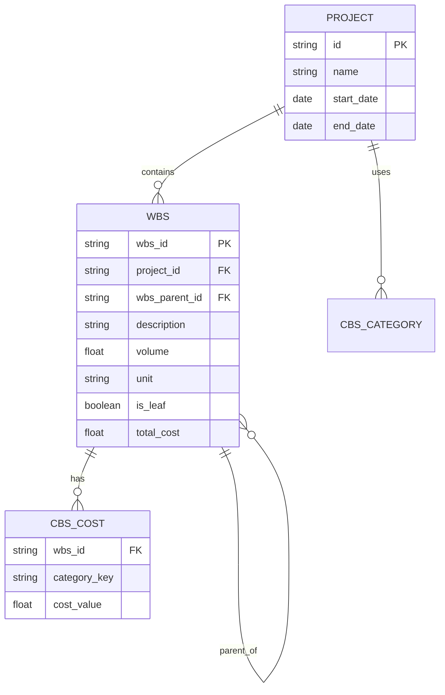

# WBS (Work Breakdown Structure) - Complete Documentation

## Daftar Isi

1.  [Overview](#overview)
2.  [1. Data Types](#1-data-types)
3.  [2. File Structure](#2-file-structure)
4.  [3. Zustand Store (useWBSStore)](#3-zustand-store-usewbsstore)
5.  [4. Utility Functions](#4-utility-functions)
6.  [4. Table Component (WBSTableInline.tsx)](#4-table-component-wbstableinlinettsx)
7.  [5. Edit Mode & Data Flow](#5-edit-mode--data-flow)
8.  [6. Kapan Kirim Data ke Backend?](#6-kapan-kirim-data-ke-backend)
9.  [7. Alternatif: Batch Save (Opsional)](#7-alternatif-batch-save-opsional)
10. [8. Application Flow (Detail)](#8-application-flow-detail)
11. [9. Cost Calculation Rules](#9-cost-calculation-rules)
12. [10. Backend API Reference](#10-backend-api-reference)
13. [11. Inline Editing Flow](#11-inline-editing-flow)
14. [12. Unit Data Integration](#12-unit-data-integration)
15. [13. TanStack Query (React Query) Integration Guide](#13-tanstack-query-react-query-integration-guide)
16. [14. Recent Updates & New Features](#14-recent-updates--new-features)
17. [15. Backend Integration Concept](#15-backend-integration-concept)
18. [16. Frontend Function Calls Detail](#16-frontend-function-calls-detail)
19. [17. Frontend Optimization Strategy](#17-frontend-optimization-strategy-best-practice)
20. [18. Migration Checklist](#18-migration-checklist)

## Overview

WBS adalah sistem untuk mengelola struktur pekerjaan proyek dengan hierarki tree. Setiap item memiliki biaya berdasarkan kategori CBS yang dipilih khusus untuk proyek tersebut di halaman Project Overview. Parent nodes mengakumulasi biaya dari children.

**PENTING:** Data WBS bersifat spesifik per proyek. Identitas proyek diambil dari URL (`projectId`) dan digunakan untuk memisahkan data antar proyek di level Frontend (Store) dan Backend (Database).

---

## 1. Data Types

```typescript
// src/types/cbs-wbs.ts
export type WBSData = {
  wbs_id: string; // ID hierarkis ("1", "1.1", "1.1.1")
  wbs_parent_id: string; // ID parent ("" untuk root)
  description: string; // Deskripsi pekerjaan
  volume: number; // Volume/kuantitas
  unit: string; // Satuan ("m", "m2", "m3")
  cbs_category: WBSCostMap; // Map kategori CBS ke cost
  totalCost: number; // Total biaya (calculated)
  is_leaf: boolean; // true = leaf node (bisa input cost)
  children?: WBSData[]; // Child items (untuk tree structure)
};

export type WBSCostMap = Record<string, number>;
// Contoh: { "material": 50000, "sewa_alat": 25000 }
```

**Item Types:**
| Type | Level | Has Children | Can Input Cost |
|------|-------|--------------|----------------|
| Kategori | 1 | Yes/No | Yes (if leaf) |
| Pekerjaan | 2+ | Yes/No | Yes (if leaf) |
| Subkategori | Any (2+) | No (is_leaf) | Yes |

> **PENTING - Fleksibilitas Hierarki (Updated Feb 2026):**
>
> - **Minimum 2 level**: Subkategori bisa langsung dibuat di bawah Kategori (level 1)
>   - Contoh valid: `1 → 1.1 (leaf)` tanpa perlu level 3
> - **Level 1 bisa memiliki 2 jenis child:**
>   - **Pekerjaan** (non-leaf) → akan memiliki children sendiri
>   - **Subkategori** (leaf) → langsung bisa input cost
> - **Backend tidak perlu enforce minimum level** - validasi berdasarkan `is_leaf` saja
> - Item manapun bisa menjadi leaf (`is_leaf: true`) jika dibuat sebagai "subkategori"

---

## 2. File Structure

```
src/
├── app/wbs/
│   └── page.tsx                  # WBS page with handlers
├── components/wbs/
│   ├── WBSTableInline.tsx        # Main table component
│   └── InlineWBSRow.tsx          # Inline input row
├── store/
│   └── useWBSStore.ts            # Zustand store for WBS
├── utils/
│   ├── buildWBSTree.ts           # Flat → tree conversion
│   ├── flattenWBSTree.ts         # Tree → flat conversion
│   ├── calculateWBSCost.ts       # Cost calculation
│   ├── generateNextWbsId.ts      # ID generation
│   └── formatCBSCategory.ts      # Format CBS key
└── types/
    └── cbs-wbs.ts                # Type definitions
```

---

## 3. Zustand Store (useWBSStore)

```typescript
// src/store/useWBSStore.ts
type WBSStore = {
  projectId: string | null; // ID Proyek aktif
  wbsData: WBSData[];
  setWBSData: (data: WBSData[], projectId?: string) => void;
  addItem: (item: WBSData) => void;
  updateItem: (wbsId: string, updates: Partial<WBSData>) => void;
  updateCBSCost: (wbsId: string, cbsKey: string, value: number) => void;
  deleteItem: (wbsId: string) => void;
  recalculateAllCosts: (...) => void;
  getWBSData: () => WBSData[];
  clearWBSData: () => void; // Reset data saat pindah proyek
};

// Usage di page.tsx
const {
  wbsData,
  projectId,
  setWBSData,
  clearWBSData,
  addItem,
  updateItem,
  updateCBSCost,
  deleteItem,
  recalculateAllCosts,
} = useWBSStore();
```

### Store Functions

| Function                              | Description                                       |
| ------------------------------------- | ------------------------------------------------- |
| `setWBSData(data, projectId)`         | Set seluruh data WBS dan simpan context ID Proyek |
| `addItem(item)`                       | Tambah item baru                                  |
| `updateItem(wbsId, updates)`          | Update field langsung (description, volume, unit) |
| `updateCBSCost(wbsId, cbsKey, value)` | Update CBS cost spesifik                          |
| `deleteItem(wbsId)`                   | Hapus item dan children-nya                       |
| `recalculateAllCosts(...)`            | Recalculate semua cost                            |
| `getWBSData()`                        | Get seluruh data                                  |
| `clearWBSData()`                      | Reset state store (WBS data & projectId)          |

### Zustand + Backend Integration Flow

Zustand store berfungsi sebagai **cache lokal** yang sinkron dengan backend:

```
┌──────────────────────────────────────────────────────────────────┐
│                         ARCHITECTURE                             │
├──────────────────────────────────────────────────────────────────┤
│                                                                   │
│   ┌─────────────┐      ┌──────────────┐      ┌─────────────┐     │
│   │   Backend   │ ←──→ │ Zustand Store│ ←──→ │  Component  │     │
│   │  (Database) │      │   (Cache)    │      │    (UI)     │     │
│   └─────────────┘      └──────────────┘      └─────────────┘     │
│                                                                   │
│   API Response → setWBSData() → wbsData → render table           │
│                                                                   │
└──────────────────────────────────────────────────────────────────┘
```

#### A. FETCH (Initial Load)

```typescript
// di app/projects/[projectId]/wbs/page.tsx
const params = useParams();
const projectId = params.projectId as string;

useEffect(() => {
  async function fetchWBS() {
    try {
      const response = await fetch(`/api/projects/${projectId}/wbs`);
      const data = await response.json();

      // Simpan ke Zustand store dengan context ID Proyek
      setWBSData(data, projectId);
    } catch (error) {
      toast.error("Gagal memuat data WBS");
    }
  }

  if (projectId) fetchWBS();

  // Reset saat keluar halaman
  return () => clearWBSData();
}, [projectId, setWBSData, clearWBSData]);
```

```
┌─────────────────────────────────────────────────────────────────┐
│ FETCH FLOW                                                       │
├─────────────────────────────────────────────────────────────────┤
│                                                                  │
│   Page Mount                                                     │
│       │                                                          │
│       ▼                                                          │
│   GET /api/projects/:projectId/wbs  ──────────→  Backend      │
│       │                              ┌───────────────┐           │
│       │                              │   Database    │           │
│       │                              └───────────────┘           │
│       │                                      │                   │
│       │  ←─────────── JSON Response ─────────┘                   │
│       │                                                          │
│       ▼                                                          │
│   setWBSData(data)  ────→  Zustand Store                         │
│       │                         │                                │
│       │                         ▼                                │
│       └──────────────→  UI Re-render dengan data baru            │
│                                                                  │
└─────────────────────────────────────────────────────────────────┘
```

#### B. CREATE (Add New Item)

```typescript
async function handleAddItem(type, parentId, formData) {
  const newRow: WBSData = { ... };  // Build new item

  // 1. Optimistic update - langsung update UI
  addItem(newRow);
  if (parentId) {
    updateItem(parentId, { is_leaf: false });
  }
  recalculateAllCosts(...);

  // 2. Sync ke backend
  try {
    await fetch("/api/wbs", {
      method: "POST",
      headers: { "Content-Type": "application/json" },
      body: JSON.stringify(newRow),
    });
    toast.success("Berhasil ditambahkan!");
  } catch (error) {
    // Rollback jika gagal
    deleteItem(newRow.wbs_id);
    toast.error("Gagal menyimpan ke server");
  }
}
```

```
┌─────────────────────────────────────────────────────────────────┐
│ CREATE FLOW (Optimistic Update)                                  │
├─────────────────────────────────────────────────────────────────┤
│                                                                  │
│   User klik ✅ (save)                                            │
│       │                                                          │
│       ▼                                                          │
│   addItem(newRow)  ────────→  Zustand Store                      │
│       │                            │                             │
│       │                            ▼                             │
│       │                       UI Update (Instant)                │
│       │                                                          │
│       ▼                                                          │
│   POST /api/projects/:id/wbs  ──────────────────→  Backend       │
│       │                                           │              │
│       │        ┌────────────────────────────┐     │              │
│       │        │  ✅ Success: Done          │     │              │
│       │        │  ❌ Error: Rollback store  │     │              │
│       │        └────────────────────────────┘     │              │
│       │                                           │              │
└─────────────────────────────────────────────────────────────────┘
```

#### C. UPDATE (Edit Cell)

```typescript
async function handleCellEdited(wbsId, field, value) {
  // 1. Optimistic update
  if (field.startsWith("cbs_category.")) {
    updateCBSCost(wbsId, field.split(".")[1], value);
  } else {
    updateItem(wbsId, { [field]: value });
  }
  recalculateAllCosts(...);

  // 2. Sync ke backend
  try {
    await fetch(`/api/wbs/${wbsId}`, {
      method: "PATCH",
      headers: { "Content-Type": "application/json" },
      body: JSON.stringify({ [field]: value }),
    });
  } catch (error) {
    toast.error("Gagal menyimpan perubahan");
    // Optional: refetch data untuk sync
  }
}
```

```
┌─────────────────────────────────────────────────────────────────┐
│ UPDATE FLOW                                                      │
├─────────────────────────────────────────────────────────────────┤
│                                                                  │
│   User blur dari input                                           │
│       │                                                          │
│       ▼                                                          │
│   updateItem() / updateCBSCost()  ────→  Zustand Store           │
│       │                                       │                  │
│       │                                       ▼                  │
│       │                                  UI Update (Instant)     │
│       │                                                          │
│       ▼                                                          │
│   PATCH /api/projects/:id/wbs/:wbsId  ─────────→  Backend        │
│                                                                  │
└─────────────────────────────────────────────────────────────────┘
```

#### D. DELETE (Remove Item)

```typescript
async function handleDelete(wbsId) {
  // Simpan backup untuk rollback
  const backup = wbsData.filter(
    item => item.wbs_id === wbsId || item.wbs_id.startsWith(`${wbsId}.`)
  );

  // 1. Optimistic delete
  deleteItem(wbsId);
  recalculateAllCosts(...);

  // 2. Sync ke backend
  try {
    await fetch(`/api/wbs/${wbsId}`, { method: "DELETE" });
    toast.success("Berhasil dihapus!");
  } catch (error) {
    // Rollback - restore deleted items
    backup.forEach(item => addItem(item));
    toast.error("Gagal menghapus dari server");
  }
}
```

### Kenapa Pakai Zustand + Backend?

| Benefit                   | Penjelasan                                        |
| ------------------------- | ------------------------------------------------- |
| **⚡ Instant UI**         | User langsung lihat perubahan tanpa tunggu API    |
| **🔄 Optimistic Updates** | Update UI dulu, sync ke backend di background     |
| **📦 Local Cache**        | Data tersimpan di memory, tidak perlu fetch ulang |
| **🌐 Global State**       | Akses data dari komponen mana saja                |
| **↩️ Rollback**           | Bisa revert jika API gagal                        |

---

## Alternatif: Tanpa Zustand (Direct API)

Jika tidak ingin menggunakan Zustand, bisa langsung menggunakan `useState` lokal + API calls.

### Architecture

```
┌──────────────────────────────────────────────────────────────────┐
│                    TANPA ZUSTAND                                  │
├──────────────────────────────────────────────────────────────────┤
│                                                                   │
│   ┌─────────────┐                        ┌─────────────┐         │
│   │   Backend   │ ←─────────────────────→│  Component  │         │
│   │  (Database) │                        │    (UI)     │         │
│   └─────────────┘                        └─────────────┘         │
│                                                 │                 │
│                                         const [wbsData, setWbsData]
│                                         = useState<WBSData[]>([])│
│                                                                   │
└──────────────────────────────────────────────────────────────────┘
```

### Perbedaan dengan Zustand

| Aspek                    | Dengan Zustand      | Tanpa Zustand               |
| ------------------------ | ------------------- | --------------------------- |
| State storage            | Global store        | Local `useState`            |
| Data persisten           | Ya (antar navigasi) | Tidak (hilang saat unmount) |
| Akses dari komponen lain | Ya                  | Perlu prop drilling         |
| Cocok untuk              | Single Page App     | Multi-page dengan refetch   |

### Step 1: Setup State Lokal

```typescript
// src/app/wbs/page.tsx
"use client";

import { useState, useEffect } from "react";
import { WBSData } from "@/types/cbs-wbs";

function WBSPage() {
  // State lokal untuk menyimpan data WBS
  const [wbsData, setWbsData] = useState<WBSData[]>([]);
  const [loading, setLoading] = useState(true);
  const [error, setError] = useState<string | null>(null);

  // ... rest of component
}
```

### Step 2: Fetch Data dari Backend

```typescript
// Fetch data saat component mount
useEffect(() => {
  async function fetchWBS() {
    setLoading(true);
    try {
      const response = await fetch(`/api/projects/${projectId}/wbs`);
      if (!response.ok) throw new Error("Failed to fetch");

      const data: WBSData[] = await response.json();
      setWbsData(data); // ← Simpan ke useState lokal
    } catch (err) {
      setError("Gagal memuat data WBS");
    } finally {
      setLoading(false);
    }
  }

  fetchWBS();
}, []);
```

### Step 3: Handler Functions

#### CREATE - Tambah Item Baru

```typescript
async function handleAddItem(type, parentId, formData) {
  const newRow: WBSData = {
    wbs_id: generateNextWbsId(parentId),
    wbs_parent_id: parentId ?? "",
    description: formData.description,
    volume: formData.volume ?? 0,
    unit: formData.unit ?? "",
    cbs_category: formData.cbs_cost ?? {},
    totalCost: calculateCost(...),
    is_leaf: type === "subkategori",
  };

  try {
    // 1. Kirim ke backend DULU
    const response = await fetch(`/api/projects/${projectId}/wbs`, {
      method: "POST",
      headers: { "Content-Type": "application/json" },
      body: JSON.stringify(newRow),
    });

    if (!response.ok) throw new Error("Failed to create");

    // 2. Update state SETELAH backend sukses
    setWbsData(prev => {
      let updated = [...prev, newRow];
      if (parentId) {
        updated = updated.map(item =>
          item.wbs_id === parentId
            ? { ...item, is_leaf: false, cbs_category: {} }
            : item
        );
      }
      return recalculateAllCosts(updated);
    });

    toast.success("Berhasil ditambahkan!");

  } catch (error) {
    toast.error("Gagal menyimpan ke server");
  }
}
```

#### UPDATE - Edit Cell

```typescript
async function handleCellEdited(wbsId: string, field: string, value: any) {
  try {
    // 1. Kirim ke backend DULU
    await fetch(`/api/wbs/${wbsId}`, {
      method: "PATCH",
      headers: { "Content-Type": "application/json" },
      body: JSON.stringify({ [field]: value }),
    });

    // 2. Update state SETELAH backend sukses
    setWbsData((prev) => {
      const updated = prev.map((item) => {
        if (item.wbs_id !== wbsId) return item;

        if (field.startsWith("cbs_category.")) {
          const cbsKey = field.split(".")[1];
          return {
            ...item,
            cbs_category: { ...item.cbs_category, [cbsKey]: value },
          };
        }

        return { ...item, [field]: value };
      });

      return recalculateAllCosts(updated);
    });
  } catch (error) {
    toast.error("Gagal menyimpan perubahan");
  }
}
```

#### DELETE - Hapus Item

```typescript
async function handleDelete(wbsId: string) {
  try {
    // 1. Kirim ke backend DULU
    await fetch(`/api/wbs/${wbsId}`, { method: "DELETE" });

    // 2. Update state SETELAH backend sukses
    setWbsData((prev) => {
      let updated = prev.filter((item) => {
        if (item.wbs_id === wbsId) return false;
        if (item.wbs_id.startsWith(`${wbsId}.`)) return false;
        return true;
      });

      // Update parent jika perlu jadi leaf
      const deletedItem = prev.find((item) => item.wbs_id === wbsId);
      if (deletedItem?.wbs_parent_id) {
        const remainingChildren = updated.filter(
          (item) => item.wbs_parent_id === deletedItem.wbs_parent_id
        );
        if (remainingChildren.length === 0) {
          updated = updated.map((item) =>
            item.wbs_id === deletedItem.wbs_parent_id
              ? { ...item, is_leaf: true, totalCost: 0 }
              : item
          );
        }
      }

      return recalculateAllCosts(updated);
    });

    toast.success("Berhasil dihapus!");
  } catch (error) {
    toast.error("Gagal menghapus dari server");
  }
}
```

### Step 4: Render ke Table

```typescript
// Convert flat data ke tree untuk table
const tableData = buildWBSTree(wbsData);

return (
  <Layout>
    {loading ? (
      <Loading />
    ) : error ? (
      <div className="text-red-500">{error}</div>
    ) : (
      <WBSTableInline
        data={tableData}           // Tree structure
        flatData={wbsData}         // Flat array untuk ID generation
        cbsColumns={userCBS}
        cbsData={selectedCBS}
        onCellEdited={handleCellEdited}
        onDelete={handleDelete}
        onAddItem={handleAddItem}
      />
    )}
  </Layout>
);
```

### Flow Diagram

```
┌─────────────────────────────────────────────────────────────────┐
│ TANPA ZUSTAND FLOW                                               │
├─────────────────────────────────────────────────────────────────┤
│                                                                  │
│   1. PAGE MOUNT                                                  │
│      │                                                           │
│      ▼                                                           │
│   GET /api/projects/:projectId/wbs ────────→ Backend     │
│      │                                │                          │
│      │←─── JSON Response ─────────────┘                          │
│      │                                                           │
│      ▼                                                           │
│   setWbsData(response)                                           │
│      │                                                           │
│      ▼                                                           │
│   buildWBSTree(wbsData) ──→ tableData                            │
│      │                                                           │
│      ▼                                                           │
│   <WBSTableInline data={tableData} />                            │
│                                                                  │
├─────────────────────────────────────────────────────────────────┤
│                                                                  │
│   2. USER ACTION (Create/Update/Delete)                          │
│      │                                                           │
│      ▼                                                           │
│   API Call (POST/PATCH/DELETE) ────→ Backend                     │
│      │                                    │                      │
│      │←────── Response ──────────────────┘                       │
│      │                                                           │
│      ▼                                                           │
│   setWbsData(updatedData) ← IF SUCCESS                           │
│      │                                                           │
│      ▼                                                           │
│   Re-render table                                                │
│                                                                  │
└─────────────────────────────────────────────────────────────────┘
```

### Kapan Pakai Pendekatan Ini?

| Gunakan jika...                                     |
| --------------------------------------------------- |
| ✅ Data tidak perlu diakses dari halaman lain       |
| ✅ OK untuk refetch setiap kali masuk halaman       |
| ✅ Ingin arsitektur lebih simple tanpa global store |
| ✅ Backend response time cepat                      |

---

## 4. Utility Functions

### buildWBSTree

Converts flat array to tree structure for table display.

```typescript
import { buildWBSTree } from "@/utils/buildWBSTree";

const flatData = [
  { wbs_id: "1", wbs_parent_id: "", ... },
  { wbs_id: "1.1", wbs_parent_id: "1", ... },
];

const treeData = buildWBSTree(flatData);
// Output: [{ wbs_id: "1", children: [{ wbs_id: "1.1" }] }]
```

### flattenWBSTree

Converts tree back to flat array.

```typescript
import { flattenWBSTree } from "@/utils/flattenWBSTree";

const flatData = flattenWBSTree(treeData);
```

### calculateWBSCost

Calculates total cost for a leaf node.

```typescript
import { calculateWBSCost } from "@/utils/calculateWBSCost";

const cbsCategories = [
  { name: "Material", type: "Per Item", cost: 50000 },
  { name: "Tenaga Kerja", type: "Borongan", cost: 100000 },
];

const total = calculateWBSCost(volume, cbsCategories);
// Per Item: cost × volume
// Borongan: cost (fixed)
```

### calculateParentCost

Calculates parent cost from children sum.

```typescript
import { calculateParentCost } from "@/utils/calculateWBSCost";

const parentTotal = calculateParentCost(children);
// Returns: sum of all children.totalCost
```

---

## 4. Table Component (WBSTableInline.tsx)

### Props

```typescript
type WBSTableInlineProps = {
  data: WBSData[]; // Tree structure for display
  flatData: WBSData[]; // Flat array for ID generation
  cbsColumns?: ColumnProps[]; // CBS column definitions
  cbsData?: CBSData[]; // CBS data for inline row
  onCellEdited?: (wbsId: string, field: string, value: any) => void;
  onDelete?: (wbsId: string) => void;
  onAddItem?: (type, parentId, data) => void;
};
```

### Table Headers

```typescript
const baseHeaders = ["WBS ID", "Description", "Volume", "Satuan"];
const cbsHeaders = cbsColumns.map((col) => col.header); // Dynamic
const otherHeaders = ["Cost", "Action"];
const allHeaders = [...baseHeaders, ...cbsHeaders, ...otherHeaders];
```

### Styling

- **Header**: Dark gray (`bg-gray-700 text-white`)
- **Parent rows**: Light gray + bold (`bg-gray-100/50 font-semibold`)
- **Leaf rows**: White
- **Inline edit row**: Light blue (`bg-blue-50/50`)
- **WBS ID**: Indented based on level (`paddingLeft: (level - 1) * 20px`)
- **Total Cost Row**: White background with bold text (`bg-white border-t-2`)

### Total Cost Row

Di akhir tabel WBS, terdapat baris **Total Biaya** yang menampilkan jumlah total dari semua cost.

```
┌──────────────────────────────────────────────────────────────────────────────┐
│ WBS ID │ Description │ Volume │ Satuan │ Material │ ... │ Cost    │ Action   │
├──────────────────────────────────────────────────────────────────────────────┤
│   1    │ TANAH       │   -    │   -    │    -     │ ... │ 500.000 │   🗑️    │
│  1.1   │ Pekerjaan   │   -    │   -    │    -     │ ... │ 500.000 │   🗑️    │
│ 1.1.1  │ Galian      │  100   │   m3   │  50.000  │ ... │ 500.000 │   🗑️    │
├──────────────────────────────────────────────────────────────────────────────┤
│                                        TOTAL BIAYA │  Rp 500.000   │          │
└──────────────────────────────────────────────────────────────────────────────┘
       ↑ White background, bold dark text with top border
```

#### Implementation

```tsx
// Render in tbody (after all rows)
{
  data.length > 0 && (
    <tr className="border-t-2 border-gray-200 bg-white">
      <td
        colSpan={baseHeaders.length + cbsColumns.length}
        className="px-4 py-3 text-right text-sm font-bold tracking-wide text-gray-900 uppercase"
      >
        Total Cost
      </td>
      <td className="px-4 py-3 text-center text-base font-bold text-gray-900">
        {totalCost.toLocaleString("id-ID", {
          style: "currency",
          currency: "IDR",
          minimumFractionDigits: 0,
          maximumFractionDigits: 0,
        })}
      </td>
      {isEditMode && <td className="px-3 py-3"></td>}
    </tr>
  );
}
```

#### Styling Details

| Element    | Style                        | Description                                 |
| ---------- | ---------------------------- | ------------------------------------------- |
| Background | `bg-white`                   | Background putih, konsisten dengan row lain |
| Border     | `border-t-2 border-gray-200` | Garis pemisah tebal di atas                 |
| Text Color | `text-gray-900`              | Hitam/Dark gray agar jelas terbaca          |
| Font       | `font-bold`                  | Bold untuk penekanan bahwa ini adalah total |
| Format     | IDR currency                 | `Rp X.XXX.XXX` format Indonesia             |

> **Catatan:** Total dihitung dari top-level items saja (level 1) untuk menghindari double-counting karena parent sudah mengakumulasi biaya dari children.

### Action Buttons per Level

| Parent Level         | Buttons                                  |
| -------------------- | ---------------------------------------- |
| Level 1 (Kategori)   | + Tambah Pekerjaan                       |
| Level 2+ (Pekerjaan) | + Tambah Pekerjaan, + Tambah Subkategori |
| Bottom of table      | + Tambah Kategori                        |

---

## 5. Edit Mode & Data Flow

### Edit Mode Toggle

Table memiliki 2 mode:

- **Read Mode** (default): Table read-only, tidak bisa edit
- **Edit Mode**: Aktifkan dengan klik tombol "Edit" untuk mulai mengedit

```
┌─────────────────────────────────────────────────────────────┐
│  [Read Mode]                                    [Edit ✏️]   │
│  ┌─────────────────────────────────────────────────────┐   │
│  │ WBS ID │ Description │ Volume │ ... │ Cost │       │   │
│  │   1    │ TANAH       │   -    │ ... │ 1000 │       │   │ ← Read only
│  └─────────────────────────────────────────────────────┘   │
└─────────────────────────────────────────────────────────────┘

┌─────────────────────────────────────────────────────────────┐
│  [Edit Mode]                                   [Simpan 💾]  │
│  ┌─────────────────────────────────────────────────────┐   │
│  │ WBS ID │ Description │ Volume │ ... │ Cost │ Action│   │
│  │   1    │ [TANAH    ] │   -    │ ... │ 1000 │  🗑️  │   │ ← Editable
│  │        │ + Tambah Pekerjaan   │ + Tambah Subkategori│   │
│  │        │────────────────────────────────────────────│   │
│  │        │ + Tambah Kategori                         │   │
│  └─────────────────────────────────────────────────────┘   │
└─────────────────────────────────────────────────────────────┘
```

---

## 6. Kapan Kirim Data ke Backend?

### ⚠️ PENTING: Data Update Real-time!

Dengan implementasi saat ini, data **terupdate real-time** setiap kali user selesai mengedit (blur dari input field), BUKAN saat klik "Simpan".

### Timing API Calls:

| Action     | Trigger                             | API Call                          |
| ---------- | ----------------------------------- | --------------------------------- |
| **CREATE** | User klik ✅ (check) di inline form | `POST /api/wbs`                   |
| **UPDATE** | User blur dari input field          | `PATCH /api/wbs/:id`              |
| **DELETE** | User klik 🗑️ + confirm              | `DELETE /api/wbs/:id`             |
| **Simpan** | User klik "Simpan"                  | Exit edit mode only (no API call) |

### A. CREATE Flow (POST)

```
User Action                          Frontend                        Backend
───────────────────────────────────────────────────────────────────────────────
1. Klik "+ Tambah Kategori"    →  Show inline form
2. Isi form
3. Klik ✅ (check)             →  handleAddItem()
                                     ├─ Generate WBS ID
                                     ├─ Create WBSData object
                                     ├─ POST /api/wbs          →  Save to DB
                                     └─ Update local state
```

**Kapan POST dipanggil:** Saat user klik tombol ✅ (check/save) di inline form

### B. UPDATE Flow (PATCH)

```
User Action                          Frontend                        Backend
───────────────────────────────────────────────────────────────────────────────
1. Klik "Edit" button          →  Enter edit mode
2. Edit cell (type)            →  (input value changes)
3. Blur (klik keluar)          →  handleCellEdited()
                                     ├─ Update local state
                                     ├─ Recalculate costs
                                     └─ PATCH /api/wbs/:id     →  Update in DB
```

**Kapan PATCH dipanggil:** Saat user blur (klik keluar) dari input field

> ⚠️ **Catatan:** Setiap kali blur, langsung kirim PATCH. Tidak menunggu klik "Simpan".

### C. DELETE Flow (DELETE)

```
User Action                          Frontend                        Backend
───────────────────────────────────────────────────────────────────────────────
1. Klik 🗑️ (trash icon)        →  Show confirm dialog
2. Confirm "Yes"               →  handleDelete()
                                     ├─ Remove from state (+ children)
                                     ├─ Recalculate parent costs
                                     └─ DELETE /api/wbs/:id    →  Delete in DB
```

**Kapan DELETE dipanggil:** Saat user confirm delete di dialog

### D. SAVE Flow (Exit Edit Mode)

```
User Action                          Frontend                        Backend
───────────────────────────────────────────────────────────────────────────────
1. Klik "Simpan"               →  handleToggleEditMode()
                                     ├─ Clear editing state
                                     ├─ Call onSave callback
                                     └─ Exit edit mode         →  (No API call)
```

**Kapan onSave dipanggil:** Hanya exit edit mode, TIDAK ada API call karena data sudah tersimpan real-time

---

## 7. Alternative: Batch Save (Opsional)

Jika ingin data HANYA tersimpan saat klik "Simpan", perlu implementasi berbeda:

```typescript
// 1. Gunakan draft state untuk perubahan
const [draftChanges, setDraftChanges] =
  useState<Map<string, Partial<WBSData>>>();

// 2. handleCellEdited hanya update draft, tidak kirim API
function handleCellEdited(wbsId, field, value) {
  setDraftChanges((prev) => ({
    ...prev,
    [wbsId]: { ...prev[wbsId], [field]: value },
  }));
}

// 3. handleSave batch commit semua perubahan
async function handleSave() {
  for (const [wbsId, changes] of Object.entries(draftChanges)) {
    await fetch(`/api/projects/${projectId}/wbs/${wbsId}`, {
      method: "PATCH",
      body: JSON.stringify(changes),
    });
  }
  setDraftChanges({});
}
```

---

## 8. Application Flow (Detail)

### A. Render Data (GET)

```typescript
// Di page.tsx
const [wbsData, setWbsData] = useState<WBSData[]>([]);

useEffect(() => {
  async function fetchWBS() {
    const response = await fetch(`/api/projects/${projectId}/wbs`);
    const data = await response.json();
    setWbsData(data); // Flat array from backend
  }
  fetchWBS();
}, []);

// Convert to tree for display
const tableData = buildWBSTree(wbsData);

// Render
<WBSTableInline
  data={tableData}
  flatData={wbsData}
  cbsColumns={userCBS}
  cbsData={selectedCBS}
  onCellEdited={handleCellEdited}
  onDelete={handleDelete}
  onAddItem={handleAddItem}
/>
```

### B. Create New Item (POST)

```typescript
async function handleAddItem(
  type: "kategori" | "pekerjaan" | "subkategori",
  parentId: string | null,
  formData: InlineWBSFormData
) {
  const newId = generateNextWbsId(parentId, wbsData);
  const isLeaf = type === "subkategori";

  const newRow: WBSData = {
    wbs_id: newId,
    wbs_parent_id: parentId ?? "",
    description: formData.description,
    volume: formData.volume ?? 0,
    unit: formData.unit ?? "",
    cbs_category: isLeaf ? formData.cbs_cost : {},
    totalCost: isLeaf ? calculateCost(...) : 0,
    is_leaf: isLeaf,
  };

  // 1. POST ke backend
  await fetch(`/api/projects/${projectId}/wbs`, {
    method: "POST",
    headers: { "Content-Type": "application/json" },
    body: JSON.stringify(newRow),
  });

  // 2. Update state
  setWbsData((prev) => recalculateAllCosts([...prev, newRow]));
}
```

### C. Edit Cell (PATCH)

```typescript
async function handleCellEdited(wbsId: string, field: string, value: any) {
  // 1. Update state
  setWbsData((prev) => {
    let updated = prev.map((item) => {
      if (item.wbs_id !== wbsId) return item;

      // Handle nested CBS field
      if (field.startsWith("cbs_category.")) {
        const key = field.split(".")[1];
        return {
          ...item,
          cbs_category: { ...item.cbs_category, [key]: value },
        };
      }

      return { ...item, [field]: value };
    });

    return recalculateAllCosts(updated);
  });

  // 2. PATCH ke backend
  await fetch(`/api/projects/${projectId}/wbs/${wbsId}`, {
    method: "PATCH",
    headers: { "Content-Type": "application/json" },
    body: JSON.stringify({ [field]: value }),
  });
}
```

### D. Delete Item (DELETE)

```typescript
async function handleDelete(wbsId: string) {
  // 1. Delete dari state (termasuk children)
  setWbsData((prev) => {
    const filtered = prev.filter((item) => {
      if (item.wbs_id === wbsId) return false;
      if (item.wbs_id.startsWith(`${wbsId}.`)) return false;
      return true;
    });

    return recalculateAllCosts(filtered);
  });

  // 2. DELETE ke backend
  await fetch(`/api/projects/${projectId}/wbs/${wbsId}`, { method: "DELETE" });
}
```

---

## 9. Cost Calculation Rules

### Leaf Nodes (is_leaf = true)

```typescript
totalCost = cbsCategories.reduce((total, cbs) => {
  if (cbs.type === "Per Item") {
    return total + cbs.cost * volume;
  } else {
    // Borongan
    return total + cbs.cost;
  }
}, 0);
```

### Parent Nodes (is_leaf = false)

```typescript
totalCost = children.reduce((sum, child) => sum + child.totalCost, 0);
```

**Cost bubbles up**: When a child's cost changes, all ancestors' costs are recalculated.

---

## 10. Backend API Reference

### GET: Fetch WBS Data

**Endpoint:** `GET /api/projects/:projectId/wbs`

**Response (Flat Array):**

```json
[
  {
    "wbs_id": "1",
    "wbs_parent_id": "",
    "description": "TANAH",
    "volume": 0,
    "unit": "",
    "cbs_category": {},
    "totalCost": 4117152.85,
    "is_leaf": false
  },
  {
    "wbs_id": "1.1",
    "wbs_parent_id": "1",
    "description": "Pekerjaan Tanah",
    "volume": 0,
    "unit": "",
    "cbs_category": {},
    "totalCost": 4117152.85,
    "is_leaf": false
  },
  {
    "wbs_id": "1.1.1",
    "wbs_parent_id": "1.1",
    "description": "Galian tanah dalam 1 m",
    "volume": 56330,
    "unit": "m3",
    "cbs_category": {
      "material": 62070.75,
      "sewa_alat": 0,
      "sewa_tenaga_kerja": 0
    },
    "totalCost": 4117152.85,
    "is_leaf": true
  }
]
```

### POST: Create WBS Item

**Endpoint:** `POST /api/projects/:projectId/wbs`

**Request:**

```json
{
  "wbs_id": "1.1.2",
  "wbs_parent_id": "1.1",
  "description": "Galian tanah dalam 2 m",
  "volume": 1000,
  "unit": "m3",
  "cbs_category": {
    "material": 75000,
    "sewa_alat": 25000
  },
  "totalCost": 100000000,
  "is_leaf": true
}
```

### PATCH: Update WBS Item

**Endpoint:** `PATCH /api/projects/:projectId/wbs/:wbs_id`

**Request (partial update):**

```json
{
  "description": "Updated description",
  "volume": 2000
}
```

Atau untuk update CBS cost:

```json
{
  "cbs_category.material": 80000
}
```

### DELETE: Delete WBS Item

**Endpoint:** `DELETE /api/projects/:projectId/wbs/:wbs_id`

**Note:** Backend harus cascade delete semua children yang `wbs_id` dimulai dengan ID yang dihapus.

Contoh: Hapus `1.1` → otomatis hapus `1.1.1`, `1.1.2`, dll.

---

## 11. Inline Editing Flow

### InlineWBSRow Component

```typescript
type InlineWBSRowProps = {
  type: "kategori" | "pekerjaan" | "subkategori";
  wbsId: string; // Auto-generated
  cbsData?: CBSData[]; // For CBS cost inputs
  onSave: (data) => void;
  onCancel: () => void;
  indent?: number; // For visual alignment
};
```

### Fields by Type

| Type        | description | volume | unit | cbs_cost |
| ----------- | ----------- | ------ | ---- | -------- |
| kategori    | ✅          | ❌     | ❌   | ❌       |
| pekerjaan   | ✅          | ❌     | ❌   | ❌       |
| subkategori | ✅          | ✅     | ✅   | ✅       |

### Form Position

- Inline form muncul **tepat di bawah children parent** yang sedang ditambahkan
- Untuk kategori baru (no parent), form muncul di bottom sebelum tombol "Tambah Kategori"

---

## 12. Unit Data Integration

Untuk membuat pilihan satuan (unit options) dinamis dari backend, ikuti langkah berikut:

### 1. Data Structure from Backend

**Endpoint:** `GET /api/units`

**Response:**

```json
["m", "m2", "m3", "kg", "ton", "ls"]
```

_Atau jika object:_

```json
[
  { "id": 1, "code": "m", "name": "Meter Lari" },
  { "id": 2, "code": "m2", "name": "Meter Persegi" }
]
```

### 2. Frontend Render (InlineWBSRow.tsx)

Pass data unit via props ke component row.

#### A. Fetch Data (Parent Component)

Di `src/app/wbs/page.tsx`:

```tsx
const [units, setUnits] = useState<string[]>([]);

useEffect(() => {
  // Fetch units from API
  fetch("/api/units")
    .then((res) => res.json())
    .then((data) => setUnits(data));
}, []);

// Pass ke WBSTableInline
<WBSTableInline
  unitOptions={units}
  // ... other props
/>;
```

#### B. Pass Props (Table Component)

Update `WBSTableInline.tsx` untuk terima props:

```tsx
type WBSTableInlineProps = {
  unitOptions?: string[]; // Add this prop
  // ... other props
};

// Pass ke InlineWBSRow saat render
<InlineWBSRow
  unitOptions={unitOptions}
  // ...
/>;
```

#### C. Render Dropdown (InlineWBSRow.tsx)

Update `InlineWBSRow.tsx`:

```tsx
// 1. Terima props
type InlineWBSRowProps = {
  unitOptions?: string[]; // Default: ["m", "m2", "m3"]
  // ...
};

export default function InlineWBSRow({
  unitOptions = ["m", "m2", "m3"], // Fallback default
  // ...
}: InlineWBSRowProps) {
  // 2. Render di Select
  <select
    value={unit}
    onChange={(e) => setUnit(e.target.value)}
    className="..."
  >
    <option value="">Pilih</option>
    {unitOptions.map((opt) => (
      <option key={opt} value={opt}>
        {opt}
      </option>
    ))}
  </select>;
}
```

---

## 13. TanStack Query (React Query) Integration Guide (Detailed)

Gunakan TanStack Query untuk menangani sinkronisasi antara Frontend dan Backend secara otomatis. Pola ini menggantikan pengelolaan manual di Zustand untuk urusan fetching dan caching.

### A. Integrasi Fungsi Utility yang Sudah Ada

Saat menggunakan TanStack Query, kamu tetap harus memanggil fungsi-fungsi utility yang sudah kita buat sebelumnya untuk menjaga logika bisnis (perhitungan harga, ID, dan pohon):

- **`buildWBSTree(flatData)`**: Digunakan di level Page untuk mengubah hasil `useQuery` (array datar) menjadi struktur hierarki yang bisa dibaca oleh `WBSTableInline`.
- **`generateNextWbsId(parentId, flatData)`**: Dipanggil di dalam handler `onAddItem` untuk menentukan ID baru berdasarkan data yang sedang ada di _cache_ TanStack.
- **`calculateWBSCost(volume, cbsCategories)`**: Digunakan saat menambah atau mengupdate Subkategori untuk menghitung `totalCost` secara instan di UI.
- **`recalculateAllCosts(...)`**: Digunakan dalam _Optimistic Update_ untuk memastikan ketika satu volume berubah, seluruh biaya parent di atasnya ikut berubah di layar tanpa menunggu respon server.

---

### B. CRUD Step-by-Step

#### 1. GET (Membaca Data)

Gunakan `useQuery` untuk mengambil data. Hasilnya dilewatkan ke `buildWBSTree` di dalam `useMemo` agar performa tetap terjaga.

```typescript
// src/app/projects/[projectId]/wbs/page.tsx
const { data: flatData, isLoading } = useWBSQuery(projectId);

const tableData = useMemo(() => buildWBSTree(flatData || []), [flatData]);
```

#### 2. POST (Menambah Item Baru)

Saat user klik Simpan pada _Inline Row_:

1.  Generate ID menggunakan `generateNextWbsId(parentId, flatData)`.
2.  Jika tipe "Subkategori", hitung cost awal dengan `calculateWBSCost`.
3.  Panggil `mutate` untuk mengirim data ke `POST /api/projects/:id/wbs`.
4.  Gunakan `invalidateQueries` di `onSuccess` agar TanStack mengambil data terbaru yang sudah diproses total biayanya oleh Backend.

#### 3. PATCH (Update Cell / Edit)

Setiap kali user `onBlur` dari input field:

1.  Panggil `updateMutation.mutate({ wbsId, data: { [field]: value } })`.
2.  Sangat disarankan melakukan **Optimistic Update** pada `onMutate` agar angka di layar langsung berubah (termasuk total biaya parent) menggunakan fungsi `recalculateAllCosts`.

#### 4. DELETE (Hapus)

1.  Panggil API `DELETE /api/projects/:id/wbs/:wbsId`.
2.  Backend harus melakukan _cascade delete_ (menghapus item tersebut dan semua item yang ID-nya diawali dengan ID tersebut, misal: hapus `1.1` maka `1.1.1` juga hilang).

---

### C. Contoh Implementasi Hook (Optimistic)

```typescript
// src/hooks/useWBSMutations.ts
import { useMutation, useQueryClient } from "@tanstack/react-query";
import { recalculateAllCosts } from "@/utils/calculateWBSCost";

export const useWBSMutations = (projectId: string) => {
  const queryClient = useQueryClient();

  const updateMutation = useMutation({
    mutationFn: async ({ wbsId, data }) => {
      // API: PATCH /api/projects/PRJ-01/wbs/1.1.1 { volume: 100 }
      return fetch(`/api/projects/${projectId}/wbs/${wbsId}`, {
        method: "PATCH",
        body: JSON.stringify(data),
      });
    },
    onMutate: async (newData) => {
      // 1. Snapshot data lama
      const previousData = queryClient.getQueryData(["wbs", projectId]);

      // 2. Optimistic Update (UI Langsung Berubah)
      queryClient.setQueryData(["wbs", projectId], (old: WBSData[]) => {
        const updatedFlat = old.map(item =>
          item.wbs_id === newData.wbsId ? { ...item, ...newData.data } : item
        );

        // HITUNG ULANG SEMUA BIAYA PARENT SECARA LOKAL
        return recalculateAllCosts(updatedFlat, selectedCBS, ...);
      });

      return { previousData };
    },
    onError: (err, variables, context) => {
      queryClient.setQueryData(["wbs", projectId], context.previousData);
    },
    onSettled: () => {
      queryClient.invalidateQueries({ queryKey: ["wbs", projectId] });
    },
  });

  return { updateMutation };
};
```

### Keuntungan TanStack Query:

1.  **Auto-Caching**: Data tidak akan di*-fetch* ulang jika user hanya berpindah tab sebentar.
2.  **Loading States**: Kamu mendapatkan variabel `isLoading` secara gratis.
3.  **Synchronized State**: Data di seluruh tab browser yang sama akan tetap sinkron.
4.  **Error Recovery**: Jika koneksi internet putus saat edit angka, TanStack akan mengembalikan angka lama secara otomatis (rollback).

---

## 14. Recent Updates & New Features

### 14.1 Hierarchical Add Button Styling (Feb 2026)

Tombol "Tambah Subkategori" dan "Tambah Pekerjaan" kini memiliki **indentasi dinamis** berdasarkan level hierarki parent-nya. Ini membuat user lebih mudah memahami tombol mana yang menambahkan child untuk parent yang mana.

### 14.2 Flexible Hierarchy - Minimum 2 Level (Feb 2026)

**Perubahan penting:** Level 1 (Kategori) sekarang bisa langsung menambahkan **Subkategori** (leaf node) tanpa harus membuat Pekerjaan dulu.

#### Visual Representation (Updated)

```
┌──────────────────────────────────────────────────────────────────────────────┐
│ WBS ID │ Description │ Volume │ Satuan │ Material │ Cost    │ Action        │
├──────────────────────────────────────────────────────────────────────────────┤
│   1    │ TANAH       │   -    │   -    │    -     │ 500.000 │   🗑️          │
│        │└── + Tambah Pekerjaan untuk 1  │ + Tambah Subkategori untuk 1      │
│   2    │ STRUKTUR    │  100   │   m3   │  50.000  │ 500.000 │   🗑️          │
│  2.1   │ Pondasi     │  100   │   m3   │  50.000  │ 500.000 │   🗑️          │ ← Leaf langsung di level 2!
│        │└── + Tambah Subkategori untuk 2                                     │
├──────────────────────────────────────────────────────────────────────────────┤
│ + Tambah Kategori                                                            │
└──────────────────────────────────────────────────────────────────────────────┘
```

#### Implementation Details

```tsx
// src/components/wbs/WBSTableInline.tsx

const renderActionButtons = (parentId: string, level: number) => {
  // Dynamic indentation: 24px per level
  const indentPx = level * 24;

  const getButtonConfig = () => {
    if (level === 1) {
      return {
        text: `Tambah Pekerjaan untuk ${parentId}`,
        colorClass: "text-green-600 hover:bg-green-50 border-green-300",
        type: "pekerjaan" as const,
      };
    }
    return {
      text: `Tambah Subkategori untuk ${parentId}`,
      colorClass: "text-purple-600 hover:bg-purple-50 border-purple-300",
      type: "subkategori" as const,
    };
  };

  return (
    <tr className="bg-gray-50/30">
      <td colSpan={allHeaders.length} className="py-1">
        <div style={{ marginLeft: `${indentPx}px` }}>
          {/* Visual connector line (L-shaped dashed border) */}
          <div className="mr-2 h-4 border-b-2 border-l-2 border-dashed border-gray-300" />
          <Button className={`border border-dashed ${config.colorClass}`}>
            <Plus size={14} className="mr-1" />
            {config.text}
          </Button>
        </div>
      </td>
    </tr>
  );
};
```

#### Key Features

| Feature                 | Description                                                            |
| ----------------------- | ---------------------------------------------------------------------- |
| **Dynamic Indentation** | `level * 24px` margin left untuk setiap level                          |
| **Visual Connector**    | Garis "L" putus-putus untuk menunjukkan koneksi ke parent              |
| **Descriptive Text**    | Tombol menampilkan parent ID (misal: "Tambah Subkategori untuk 1.1.1") |
| **Color Coding**        | Hijau untuk Pekerjaan (level 1), Ungu untuk Subkategori (level 2+)     |
| **Border Dashed**       | Border putus-putus pada tombol untuk visual yang lebih jelas           |

---

## 15. Backend Integration Concept

### 15.1 Data Relationship



### 15.2 Database Schema Recommendation

**Tabel `wbs_items`**

| Column Name     | Type        | Description                        |
| --------------- | ----------- | ---------------------------------- |
| `id`            | UUID/Int    | Primary Key (internal)             |
| `project_id`    | UUID/String | Foreign Key ke Project             |
| `wbs_id`        | String      | ID hierarkis ("1", "1.1", "1.1.1") |
| `wbs_parent_id` | String      | Parent ID ("" untuk root)          |
| `description`   | String      | Deskripsi pekerjaan                |
| `volume`        | Float       | Volume/kuantitas                   |
| `unit`          | String      | Satuan (m, m2, m3, kg, dll)        |
| `is_leaf`       | Boolean     | true = bisa input cost             |

**Tabel `wbs_cbs_costs`** (untuk menyimpan cost per kategori)

| Column Name    | Type   | Description                   |
| -------------- | ------ | ----------------------------- |
| `wbs_id`       | String | Foreign Key ke wbs_items      |
| `category_key` | String | Key kategori CBS (snake_case) |
| `cost_value`   | Float  | Nilai biaya                   |

> **CATATAN PENTING:**
>
> - **`totalCost` adalah Derived Data** - JANGAN disimpan di database!
> - Backend harus menghitung `totalCost` secara on-the-fly saat query berdasarkan:
>   - Leaf nodes: Sum dari semua `cbs_cost` × volume (atau fixed untuk Borongan)
>   - Parent nodes: Sum dari `totalCost` semua children

### 15.3 API Endpoints

| Method   | Endpoint                              | Description                      |
| -------- | ------------------------------------- | -------------------------------- |
| `GET`    | `/api/projects/:projectId/wbs`        | Ambil semua WBS untuk proyek     |
| `POST`   | `/api/projects/:projectId/wbs`        | Tambah item WBS baru             |
| `PATCH`  | `/api/projects/:projectId/wbs/:wbsId` | Update field WBS                 |
| `DELETE` | `/api/projects/:projectId/wbs/:wbsId` | Hapus item (cascade ke children) |

### 15.4 API Request & Response Format

#### A. GET - Ambil Semua Data WBS

**Endpoint:** `GET /api/projects/:projectId/wbs`

**Response (200 OK):**

```json
{
  "success": true,
  "data": [
    {
      "wbs_id": "1",
      "wbs_parent_id": "",
      "description": "PEKERJAAN TANAH",
      "volume": 0,
      "unit": "",
      "cbs_category": {},
      "totalCost": 150000000,
      "is_leaf": false
    },
    {
      "wbs_id": "1.1",
      "wbs_parent_id": "1",
      "description": "Galian Tanah",
      "volume": 0,
      "unit": "",
      "cbs_category": {},
      "totalCost": 150000000,
      "is_leaf": false
    },
    {
      "wbs_id": "1.1.1",
      "wbs_parent_id": "1.1",
      "description": "Galian Tanah Biasa",
      "volume": 1000,
      "unit": "m3",
      "cbs_category": {
        "material": 50000,
        "sewa_alat": 75000,
        "tenaga_kerja": 25000
      },
      "totalCost": 150000000,
      "is_leaf": true
    }
  ]
}
```

> **Catatan Backend:**
>
> - Response berupa **flat array**, bukan tree. Frontend akan convert ke tree menggunakan `buildWBSTree()`.
> - `totalCost` **HARUS dihitung oleh backend** saat response:
>   - Leaf nodes: `sum(cbs_category values) × volume` atau fixed (Borongan)
>   - Parent nodes: `sum(children.totalCost)`
> - Data diurutkan berdasarkan `wbs_id` secara natural sort ("1.9" < "1.10").

---

#### B. POST - Tambah Item WBS Baru

**Endpoint:** `POST /api/projects/:projectId/wbs`

**Request Body:**

```json
{
  "wbs_parent_id": "1.1",
  "description": "Galian Tanah Keras",
  "volume": 500,
  "unit": "m3",
  "cbs_category": {
    "material": 75000,
    "sewa_alat": 100000,
    "tenaga_kerja": 50000
  },
  "is_leaf": true
}
```

> **Catatan:**
>
> - `wbs_id` **TIDAK dikirim dari frontend** - backend yang generate!
> - Backend harus:
>   1. Generate `wbs_id` berdasarkan `wbs_parent_id` (misal: "1.1" + next index = "1.1.2")
>   2. Update parent `is_leaf` menjadi `false` jika sebelumnya `true`
>   3. Recalculate `totalCost` untuk semua parent ke atas

**Response (201 Created):**

```json
{
  "success": true,
  "message": "WBS item created successfully",
  "data": {
    "wbs_id": "1.1.2",
    "wbs_parent_id": "1.1",
    "description": "Galian Tanah Keras",
    "volume": 500,
    "unit": "m3",
    "cbs_category": {
      "material": 75000,
      "sewa_alat": 100000,
      "tenaga_kerja": 50000
    },
    "totalCost": 112500000,
    "is_leaf": true
  }
}
```

**Alternative Response - Return All Updated Items:**

Jika backend ingin mengembalikan semua item yang terpengaruh (termasuk parent yang diupdate):

```json
{
  "success": true,
  "message": "WBS item created successfully",
  "data": {
    "created": {
      "wbs_id": "1.1.2",
      "description": "Galian Tanah Keras",
      "totalCost": 112500000,
      "is_leaf": true
    },
    "updated": [
      {
        "wbs_id": "1.1",
        "totalCost": 262500000,
        "is_leaf": false
      },
      {
        "wbs_id": "1",
        "totalCost": 262500000
      }
    ]
  }
}
```

---

#### C. PATCH - Update Field WBS

**Endpoint:** `PATCH /api/projects/:projectId/wbs/:wbsId`

**Request Body (Partial Update):**

```json
{
  "description": "Galian Tanah Dalam 2m"
}
```

Atau update volume:

```json
{
  "volume": 2000
}
```

Atau update CBS cost specific:

```json
{
  "cbs_category": {
    "material": 80000
  }
}
```

> **Catatan Backend:**
>
> - Hanya update field yang dikirim (partial update)
> - Jika `volume` atau `cbs_category` berubah, recalculate `totalCost`
> - Propagate perubahan `totalCost` ke semua parent ke atas

**Response (200 OK):**

```json
{
  "success": true,
  "message": "WBS item updated successfully",
  "data": {
    "wbs_id": "1.1.1",
    "wbs_parent_id": "1.1",
    "description": "Galian Tanah Dalam 2m",
    "volume": 2000,
    "unit": "m3",
    "cbs_category": {
      "material": 80000,
      "sewa_alat": 75000,
      "tenaga_kerja": 25000
    },
    "totalCost": 360000000,
    "is_leaf": true
  }
}
```

**Alternative - Return dengan Updated Parents:**

```json
{
  "success": true,
  "data": {
    "updated": {
      "wbs_id": "1.1.1",
      "totalCost": 360000000
    },
    "affected_parents": [
      { "wbs_id": "1.1", "totalCost": 472500000 },
      { "wbs_id": "1", "totalCost": 472500000 }
    ]
  }
}
```

---

#### D. DELETE - Hapus Item WBS

**Endpoint:** `DELETE /api/projects/:projectId/wbs/:wbsId`

**Request:** No body required

> **Catatan Backend - CASCADE DELETE:**
>
> - Hapus item dengan `wbs_id` yang diminta
> - **CASCADE:** Hapus semua children yang `wbs_id` dimulai dengan ID tersebut
>   - Contoh: DELETE `1.1` → hapus `1.1`, `1.1.1`, `1.1.2`, dst
> - **REINDEX:** Setelah delete, reindex siblings yang tersisa
>   - Contoh: Hapus `1.2` dari [1.1, 1.2, 1.3] → `1.3` menjadi `1.2`
> - **UPDATE PARENT:** Jika parent kehilangan semua children, set `is_leaf: true`
> - Recalculate `totalCost` untuk semua parent ke atas

**Response (200 OK):**

```json
{
  "success": true,
  "message": "WBS item and 3 children deleted successfully",
  "data": {
    "deleted_ids": ["1.2", "1.2.1", "1.2.2", "1.2.3"],
    "reindexed": [
      { "old_id": "1.3", "new_id": "1.2" },
      { "old_id": "1.3.1", "new_id": "1.2.1" }
    ],
    "affected_parents": [
      { "wbs_id": "1", "totalCost": 150000000, "is_leaf": false }
    ]
  }
}
```

**Simple Response Alternative:**

```json
{
  "success": true,
  "message": "WBS item deleted successfully",
  "deleted_count": 4
}
```

> **Frontend Note:** Setelah DELETE, frontend sebaiknya melakukan `invalidateQueries` untuk refetch data terbaru yang sudah di-reindex oleh backend.

---

#### E. Error Response Format

Semua endpoint menggunakan format error yang konsisten:

**Response (4xx/5xx):**

```json
{
  "success": false,
  "error": {
    "code": "WBS_NOT_FOUND",
    "message": "WBS item with id '1.1.5' not found"
  }
}
```

**Common Error Codes:**

| Code                | HTTP Status | Description                                  |
| ------------------- | ----------- | -------------------------------------------- |
| `WBS_NOT_FOUND`     | 404         | Item WBS tidak ditemukan                     |
| `INVALID_PARENT_ID` | 400         | Parent ID tidak valid atau tidak ada         |
| `DUPLICATE_WBS_ID`  | 409         | WBS ID sudah ada (conflict)                  |
| `VALIDATION_ERROR`  | 400         | Data tidak valid (missing field, wrong type) |
| `PROJECT_NOT_FOUND` | 404         | Project ID tidak ditemukan                   |
| `DELETE_ROOT_ERROR` | 400         | Tidak bisa hapus root tanpa menghapus semua  |

---

## 16. Frontend Function Calls Detail

### 16.1 Function Classification for Backend Integration

Berikut adalah analisis lengkap fungsi-fungsi yang ada, mana yang **tetap dipakai**, **diganti backend**, atau **dihapus**.

#### A. Fungsi yang TETAP DIPAKAI (Frontend Logic)

| Fungsi                | File                         | Alasan Tetap Dipakai                                                                                                          |
| --------------------- | ---------------------------- | ----------------------------------------------------------------------------------------------------------------------------- |
| `buildWBSTree()`      | `utils/buildWBSTree.ts`      | Mengubah flat array → tree untuk display. Backend kirim flat, frontend render tree.                                           |
| `flattenWBSTree()`    | `utils/flattenWBSTree.ts`    | Opsional untuk debugging atau export.                                                                                         |
| `generateNextWbsId()` | `utils/generateNextWbsId.ts` | **OPSIONAL** - Bisa dihandle frontend ATAU backend. Jika backend, frontend hanya kirim `parentId` dan backend return ID baru. |
| `formatCBSCategory()` | `utils/formatCBSCategory.ts` | Format string kategori CBS ke snake_case untuk consistency.                                                                   |
| `sortWBSId()`         | `utils/sortWBSId.ts`         | Sort WBS ID secara natural ("1.9" < "1.10"). Tetap dipakai untuk display.                                                     |

#### B. Fungsi yang BISA DIGANTI BACKEND (Recommended)

| Fungsi                  | File                        | Alasan Diganti Backend                                                                                                               |
| ----------------------- | --------------------------- | ------------------------------------------------------------------------------------------------------------------------------------ |
| `calculateWBSCost()`    | `utils/calculateWBSCost.ts` | **Backend HARUS menghitung total cost** saat query/response agar data konsisten. Frontend tetap bisa hitung untuk optimistic update. |
| `calculateParentCost()` | `utils/calculateWBSCost.ts` | Sama seperti di atas - backend hitung saat return data.                                                                              |
| `reindexWBS()`          | `utils/reindexWBS.ts`       | **Backend WAJIB handle reindex** saat delete item. Frontend tidak perlu reindex karena backend kirim data yang sudah benar.          |
| `recalculateAllCosts()` | `useWBSStore.ts`            | **Backend mengembalikan totalCost yang sudah dihitung**. Frontend hanya pakai untuk optimistic update sementara.                     |

#### C. Fungsi Store yang BERUBAH PERANNYA

| Fungsi Store            | Peran Saat Ini             | Peran Setelah Integrasi                              |
| ----------------------- | -------------------------- | ---------------------------------------------------- |
| `setWBSData()`          | Set data dari dummy        | Set data dari API response. **TETAP DIPAKAI**.       |
| `addItem()`             | Tambah item ke local state | **Optimistic update only**. Data final dari backend. |
| `updateItem()`          | Update local state         | **Optimistic update only**. Sync via API.            |
| `updateCBSCost()`       | Update CBS cost local      | **Optimistic update only**. Sync via API.            |
| `deleteItem()`          | Delete + reindex local     | **Optimistic delete only**. Backend handle reindex.  |
| `recalculateAllCosts()` | Recalculate semua cost     | **Optimistic only**. Backend return calculated cost. |
| `clearWBSData()`        | Reset state                | **TETAP DIPAKAI** saat unmount/pindah proyek.        |

### 16.2 Integration Flow Diagram

```
┌─────────────────────────────────────────────────────────────────────────────┐
│                        BEFORE INTEGRATION (Now)                              │
├─────────────────────────────────────────────────────────────────────────────┤
│                                                                              │
│   User Action → Store Function → Local State → Re-render                     │
│                      │                                                       │
│                      └→ generateNextWbsId()                                  │
│                      └→ reindexWBS()                                         │
│                      └→ calculateWBSCost()                                   │
│                      └→ recalculateAllCosts()                                │
│                                                                              │
│   ⚠️ Semua logic di Frontend                                                │
│                                                                              │
└─────────────────────────────────────────────────────────────────────────────┘

┌─────────────────────────────────────────────────────────────────────────────┐
│                        AFTER INTEGRATION (Recommended)                       │
├─────────────────────────────────────────────────────────────────────────────┤
│                                                                              │
│   User Action → Store Function (Optimistic) → Re-render (Instant)            │
│        │                                                                     │
│        └────────────→ API Call ───────────────→ Backend                      │
│                              │                      │                        │
│                              │              ┌───────┴──────────┐             │
│                              │              │ generateNextId() │             │
│                              │              │ reindexWBS()     │             │
│                              │              │ calculateCost()  │             │
│                              │              └───────┬──────────┘             │
│                              │                      │                        │
│                              └── Response ←─────────┘                        │
│                                     │                                        │
│               invalidateQueries() → Refetch → setWBSData() → Re-render       │
│                                                                              │
│   ✅ Logic dibagi: Optimistic di FE, Source of Truth di BE                  │
│                                                                              │
└─────────────────────────────────────────────────────────────────────────────┘
```

### 16.3 Component Function Calls

#### WBSPage (`page.tsx`) - Handler Functions

```typescript
// 1. FETCH - Saat mount
useEffect(() => {
  const fetchData = async () => {
    const response = await fetch(`/api/projects/${projectId}/wbs`);
    const data = await response.json();
    setWBSData(data, projectId);  // ← Store function
  };
  fetchData();
  return () => clearWBSData();    // ← Store function
}, [projectId]);

// 2. CREATE - Dipanggil dari WBSTableInline onAddItem
async function handleAddItem(type, parentId, formData) {
  const newRow = { /* build from formData */ };

  addItem(newRow);                // ← Store (optimistic)
  recalculateAllCosts(...);       // ← Store (optimistic)

  await fetch(`/api/...`, { method: "POST", body: JSON.stringify(newRow) });
}

// 3. UPDATE - Dipanggil dari WBSTableInline onCellEdited
async function handleCellEdited(wbsId, field, value) {
  if (field.startsWith("cbs_category.")) {
    updateCBSCost(wbsId, key, value);  // ← Store (optimistic)
  } else {
    updateItem(wbsId, { [field]: value });  // ← Store (optimistic)
  }
  recalculateAllCosts(...);       // ← Store (optimistic)

  await fetch(`/api/.../wbs/${wbsId}`, { method: "PATCH", body: ... });
}

// 4. DELETE - Dipanggil dari WBSTableInline onDelete
async function handleDelete(wbsId) {
  deleteItem(wbsId);              // ← Store (optimistic + reindex)
  recalculateAllCosts(...);       // ← Store (optimistic)

  await fetch(`/api/.../wbs/${wbsId}`, { method: "DELETE" });
}
```

#### WBSTableInline (`WBSTableInline.tsx`) - Internal Functions

```typescript
// ID Generation untuk inline editing
const generateNextId = (parentId: string | null): string => {
  // Menggunakan flatData untuk generate ID berikutnya
  // CATATAN: Bisa diganti dengan request ke backend jika preferred
};

// Action handler buttons
const handleStartEdit = (type, parentId) => {
  const wbsId = generateNextId(parentId);
  setEditingState({ isEditing: true, type, parentId, wbsId });
};

// Render dengan indentasi dinamis
const renderActionButtons = (parentId: string, level: number) => {
  const indentPx = level * 24; // Dynamic indent
  // ...
};
```

---

## 17. Frontend Optimization Strategy (Best Practice)

### 17.1 Debouncing untuk Cell Edit

Saat integrasi backend, hindari spam API setiap keystroke dengan debouncing:

```typescript
import { useDebouncedCallback } from "use-debounce";

// Di WBSPage atau custom hook
const debouncedPatch = useDebouncedCallback(
  async (wbsId: string, field: string, value: any) => {
    await fetch(`/api/projects/${projectId}/wbs/${wbsId}`, {
      method: "PATCH",
      headers: { "Content-Type": "application/json" },
      body: JSON.stringify({ [field]: value }),
    });
  },
  500  // Wait 500ms after user stops typing
);

function handleCellEdited(wbsId, field, value) {
  // 1. Update local state immediately (instant UI feedback)
  updateItem(wbsId, { [field]: value });
  recalculateAllCosts(...);

  // 2. Debounced API call (prevents spam)
  debouncedPatch(wbsId, field, value);
}
```

### 17.2 OnBlur Strategy (Current Implementation)

Implementasi saat ini sudah menggunakan `onBlur` yang efisien:

```tsx
// Di WBSTableInline.tsx
<input
  type="text"
  defaultValue={item.description}
  onBlur={(e) => onCellEdited?.(item.wbs_id, "description", e.target.value)}
  onKeyDown={(e) => {
    if (e.key === "Enter") e.currentTarget.blur(); // Enter = commit
  }}
/>
```

**Keuntungan OnBlur:**

- API hanya dipanggil sekali per field edit
- Tidak perlu library tambahan (debounce)
- User experience natural (edit selesai saat klik keluar)

### 17.3 Optimistic Update Pattern

```typescript
// Dengan TanStack Query
const updateMutation = useMutation({
  mutationFn: async ({ wbsId, data }) => {
    return fetch(`/api/.../wbs/${wbsId}`, {
      method: "PATCH",
      body: JSON.stringify(data),
    });
  },
  onMutate: async ({ wbsId, data }) => {
    // Cancel ongoing fetches
    await queryClient.cancelQueries({ queryKey: ["wbs", projectId] });

    // Snapshot untuk rollback
    const previousData = queryClient.getQueryData(["wbs", projectId]);

    // Optimistic update
    queryClient.setQueryData(["wbs", projectId], (old: WBSData[]) => {
      let updated = old.map(item =>
        item.wbs_id === wbsId ? { ...item, ...data } : item
      );
      return recalculateAllCosts(updated, ...);  // ← Masih pakai utility ini
    });

    return { previousData };
  },
  onError: (err, variables, context) => {
    // Rollback on error
    queryClient.setQueryData(["wbs", projectId], context.previousData);
    toast.error("Gagal menyimpan perubahan");
  },
  onSettled: () => {
    // Refetch untuk sync dengan backend
    queryClient.invalidateQueries({ queryKey: ["wbs", projectId] });
  },
});
```

### 17.4 Batch Operations (Optional)

Untuk operasi bulk (misal: paste dari Excel), gunakan batch API:

```typescript
// Backend endpoint
POST /api/projects/:projectId/wbs/batch
Body: { items: WBSData[] }

// Frontend
async function handleBulkImport(items: WBSData[]) {
  // 1. Optimistic: Add all items
  items.forEach(item => addItem(item));
  recalculateAllCosts(...);

  // 2. Single API call
  await fetch(`/api/.../wbs/batch`, {
    method: "POST",
    body: JSON.stringify({ items }),
  });

  // 3. Refetch untuk sync
  queryClient.invalidateQueries({ queryKey: ["wbs", projectId] });
}
```

### 17.5 Summary: Optimization Strategies

| Strategy              | Use Case              | Implementation                              |
| --------------------- | --------------------- | ------------------------------------------- |
| **OnBlur**            | Single cell edit      | Current implementation ✅                   |
| **Debounce**          | Rapid typing in input | `useDebouncedCallback` with 300-500ms delay |
| **Optimistic Update** | All mutations         | Update local state first, sync to backend   |
| **Batch Save**        | Bulk operations       | Single API call for multiple items          |
| **invalidateQueries** | Post-mutation sync    | TanStack Query auto-refetch                 |

---

## 18. Migration Checklist

### Phase 1: Basic Integration

- [ ] Setup TanStack Query provider
- [ ] Create `useWBSQuery` hook for GET
- [ ] Create `useWBSMutations` hook for POST/PATCH/DELETE
- [ ] Update `page.tsx` to use hooks instead of direct store calls

### Phase 2: Optimistic Updates

- [ ] Implement `onMutate` for instant UI updates
- [ ] Implement `onError` for rollback
- [ ] Keep `recalculateAllCosts()` for optimistic cost calculation

### Phase 3: Backend Handoff

- [ ] Backend implements `reindexWBS` logic
- [ ] Backend returns calculated `totalCost` in response
- [ ] Remove frontend `reindexWBS` calls
- [ ] Frontend relies on backend `totalCost` as source of truth

### Phase 4: Cleanup

- [ ] Remove unused utility functions (if fully handled by backend)
- [ ] Update documentation
- [ ] Add error boundaries and loading states
